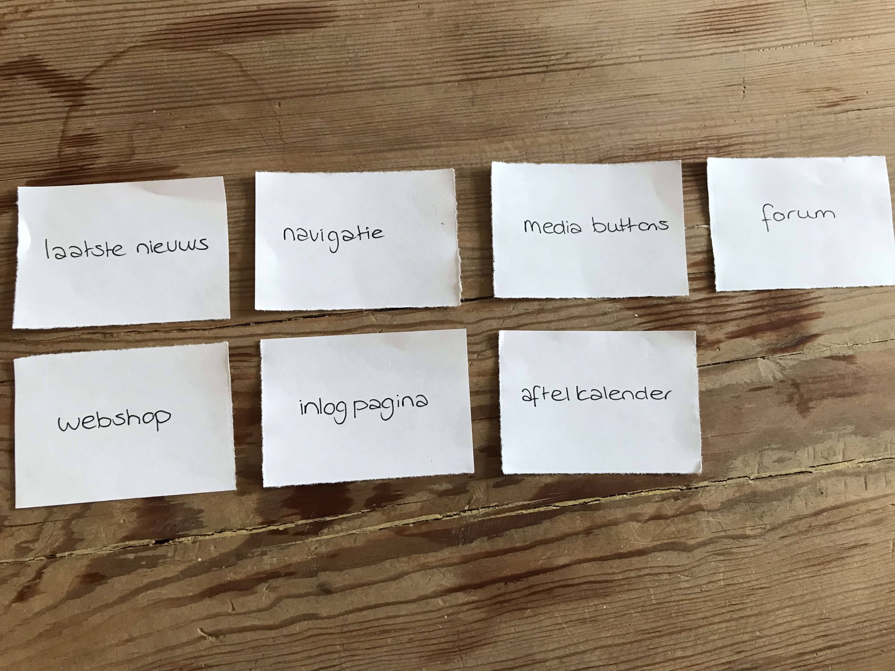
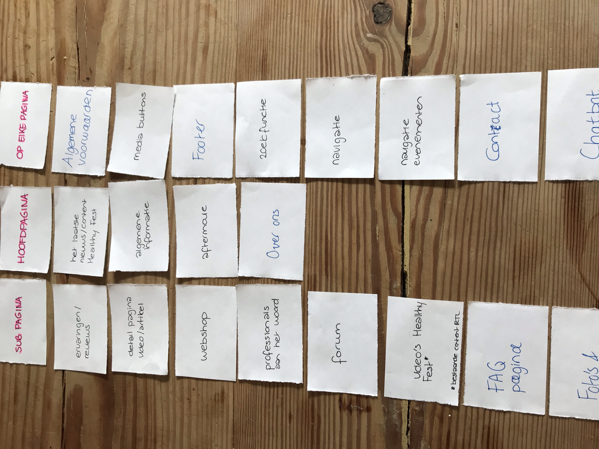
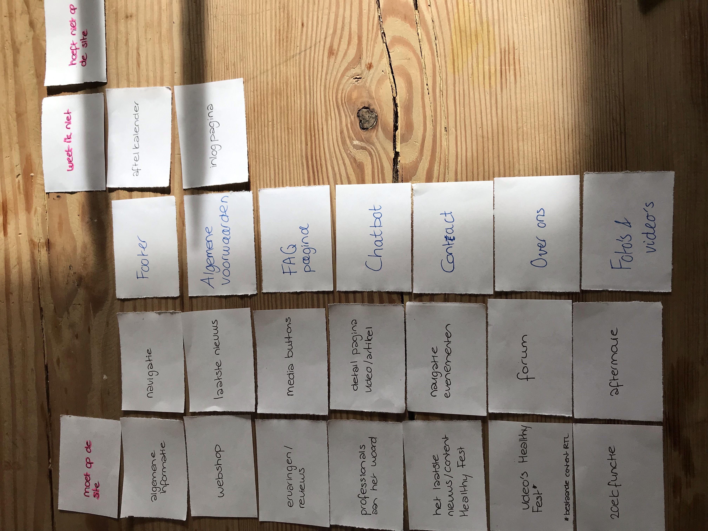
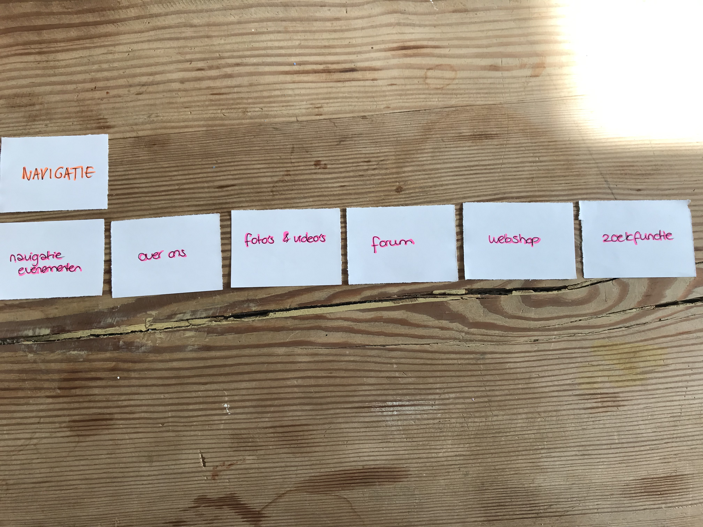

# Card Sorting

De card sorting sessie heb ik gehouden met twee deelnemers die naar Healthy Fest zijn gegaan. Dit gaat om Rebecca Weststrate \(31 jaar\) en haar vriend Dennis van Essen. Zij zijn in juni 2018 naar Healthy Fest geweest.

In het eerste deel van de sessie heb ik 7 onderwerpen op losse blaadjes geschreven, die naar voren zijn gekomen uit de methodes in de analyse fase.

Ik wilde graag weten op welke pagina's de deelnemers graag de onderwerpen zien. Hierin heb ik een onderscheid gemaakt tussen een subpagina, hoofdpagina en welk onderwerp op elke pagina moet terugkomen. Hieruit werd duidelijk dat ze twijfelden op welke pagina het laatste nieuws moest komen, waardoor de conclusie kwam dat het zowel op de hoofdpagina als op een subpagina kan voorkomen. Het kan dus zo zijn dat het laaste nieuws op de hoofdpagina voorkomt en vervolgens doorlinkt naar een sub-pagina.  

De opdracht die de deelnemers vervolgens kregen, was om meer onderwerpen te bedenken die op de website van Healthy Fest moeten voorkomen. Door de toevoegingen van de deelnemers, heb ik zelf ook weer onderwerpen toegevoegd. 

Ik wilde erachter komen of alle nieuwe \(en oude\) onderwerpen gewenst zijn op de pagina. Daarom heb ik de onderwerpen verdeeld in 'Moet op de site", 'Weet ik niet' en 'Hoef niet op de site. In principe wilden de deelnemers alles op de pagina, behalve de aftelkalender en de inlogpagina. 

Wat ik ook interessant is om te weten, is om te kijken welke onderwerpen er in de navigatie horen. Hieruit kwamen de volgende onderwerpen: navigatie evenementen, over ons, foto's en video's, forum, webshop en de zoekfunctie. 

Vervolgens heb ik gevraagd om de onderwerpen te verdelen over de navigatie. Welke onderwerpen horen er bij welke navigatie? Er werd hier gezegd dat over ons geen eigen navigatie nodig heeft, maar kan vallen onder het navigatie kopje 'navigatie evenementen'. 

Tot slot vond ik het interessant om te kijken of de deelnemers andere namen hadden voor de navigatie koppen. De andere namen voor de navigatie balk ga ik voorleggen bij de opdrachtgever RTL Live Entertainment tijdens mijn interview met Vicky van der Spoel. 

**Conclusie**

Vanuit deze card sorting sessie ben ik tot verschillende inzichten komen. Ik weet welke onderwerpen ik nog meer kan toevoegen in de website en welke onderwerpen er op welke pagina/navigatie komen. De volgende onderwerpen wil ik gaan toevoegen in de website:

* Ervaringen/reviews
* Detail pagina video/artikel
* Webshop
* Professionals aan het woord
* Forum
* FAQ pagina
* Foto's en video's
* Laatste nieuws/content Healthy Fest
* Algemene informatie
* Aftermovie
* Over ons
* Algemene voorwaarden
* Media buttons
* Footer
* Zoekfunctie
* Navigatie
* Navigatie evenementen
* Contact
* Chatbot

Van deze onderwerpen ga ik inspiratie opdoen op internet. Ik ga voorbeelden opzoeken, om te kijken hoe ik deze onderwerpen wil implementeren op de website. Vanuit deze card sorting sessie ga ik dus verder op de inspiratie, maar dit gaat mij ook helpen om de sitemap te maken en zo uiteindelijk tot een concept te komen.  
  
Ten slotte heb gebruik gemaakt van de gelegenheid om te vragen of ze behoefte hebben aan  een website van Healthy Fest met de onderdelen die ze zelf hebben gekozen. Ze gaven hier aan dat Healthy Fest bij hun thuis en bij hun vrienden vaak een gesprekonderwerp is. Hieruit hebben ze zelf geconcludeerd dat niet alleen zij, maar ook hun vrienden gebruik willen maken van de website. 

De uitkomsten van de card sorting sessie heb ik besproken Vicky van der Spoel, de opdrachtgeefster van RTL. Ze was het op zich eens met de bovenstaande onderwerpen en de sortering. Ze was het er mee eens dat de ervaringen/reviews. Op het forum komen vanzelf de ervaringen en de reviews. De indeling van de online Healhy Fest ziet zij graag in 2 onderwerpen: tips/tricks en de professionals aan het woord. Het laatste nieuws zou zij plaatsen op de homepagina, aangezien dat meteen aantrekt op die locatie.   
  
Ze wil graag een contactpagina op de website van Healthy Fest die is toegevoegd aan de navigatie. Hier moet dan het emailadres van Healthy Fest op staan en Healthy Fest Fans kunnen hier vragen stellen.   
   
De keuze van de namen ziet zij het liefste als volgende:  
  
**Navigatie evenementen:**  
Healthy Events  
  
**Foto's en video's**  
Afgelopen edities

**Online Healthy Fest**  
Meer Healthy Online

**Forum**  
Healthy Talk  
  
**Webshop  
  
Contact**

  
-

