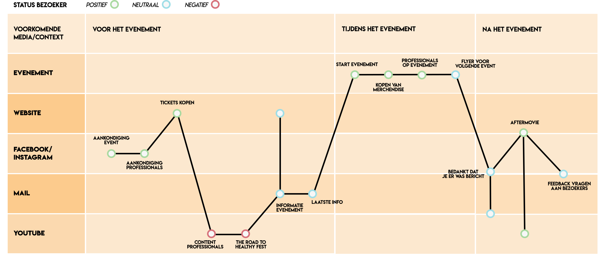
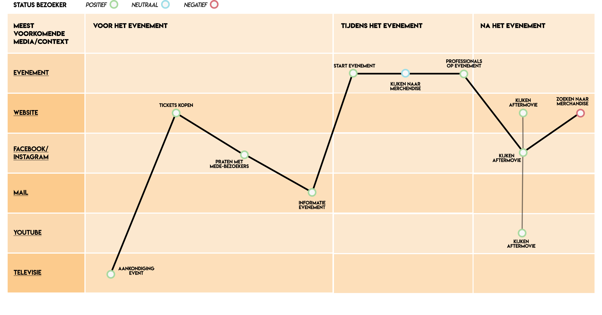
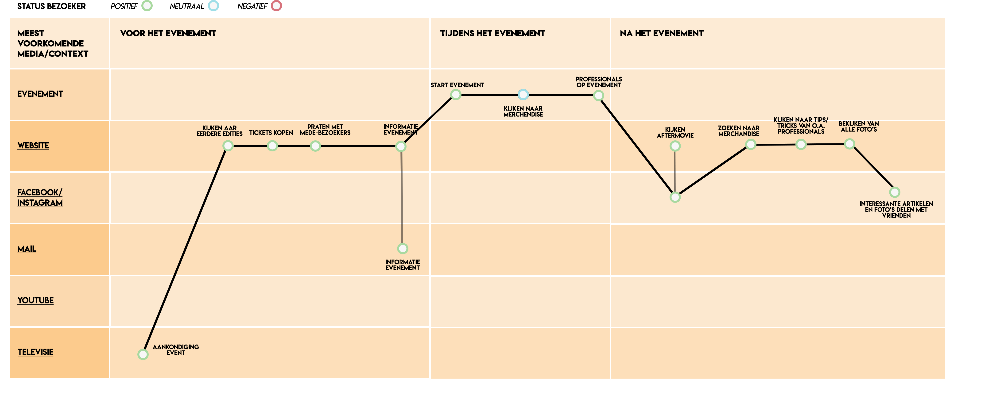

# Customer Journey

**Oude situatie // Customer Journey 0.9**  
Naar aanleiding van de nieuwe persona, heb ik een Customer Journey opgesteld van de huidige situatie. Opvallend te zien is dat de bezoeker een negatieve ervaring heeft bij het kijken van de content van de professionals en een eigen programma van Healthy Fest: The Road to Healthy Fest. De doelgroep geeft al aan in de enquête blogs/video's te willen zien over content die Healthy Fest op dit medium post. Na het evenement bekijken ze de aftermovie, worden ze betrokken met de inhoud van de volgende versie van Healthy Fest en krijgen ze weer informatie van de professionals en de laatste tips/tricks. Na het herontwerp wil ik geen negatieve Healthy Fest Fans meer hebben en zal de nieuwe situatie hieronder weergegeven worden.  
  
**Oude situatie // Customer Journey 1.0**  
Na het onderzoek over het gedrag en de behoeftes van de bezoekers, kwam ik erachter dat de bezoekers deze content helemaal niet bekijken. En na een van de feedback gesprekken, ben ik erachter gekomen dat mijn oude Customer Journey \(0.9\) dus niet goed in elkaar zit. In deze Customer Journey staat dat de bezoeker bijvoorbeeld een negatieve ervaring heeft met het bekijken van de content over de professionals en The Road to Healthy Fest. Daarom heb ik een nieuwe Customer Journey gemaakt, gebaseerd op de weg van de bezoeker voor het evenement, tijdens het evenement en na het evenement.   
  
 In de Customer Journey 1.0 staat deze weg van de bezoeker. Hier kun je zien dat het eerste moment dat de bezoeker met Healthy Fest in contact kom, op televisie is. De bezoeker ziet dan een reclame over Healthy Fest. In deze reclame wordt gezegd dat de bezoeker op de website tickets kan kopen. Vervolgens gaat de bezoeker naar de Facebookpagina van Healthy Fest en praat daar met mede bezoekers over de ervaring of probeert er bijvoorbeeld een Facebook maatje te zoeken. Vervolgens koopt de bezoeker een kaartje voor het evenement en krijgt via de mail de informatie over het evenement. Tijdens het evenement bekijkt de bezoeker de merchandise, maar koopt niet altijd wat. Ook zien ze de professionals op het evenement, die de bezoeker erg interessant vindt. Na het evenement kijken ze de aftermovie, die op meerdere kanalen te vinden is. Tot slot heeft een deel van de bezoekers spijt, omdat ze nog geen merchandise aangeschaft hebben. 

















Bij de nieuwe situatie van de Customer Journey zie je dat er veel meer gebruik wordt gemaakt van de website door de gebruiker. Voordat ze de tickets gaan kopen, gaan ze eerst de website bekijken en krijgen ze een indruk van de vorige editie. Vervolgens gaan ze een ticket kopen en praten ze van te voren met bezoekers over Healthy Fest. Ze kunnen de informatie zien op hun eigen profielpagina, maar krijgen deze informatie ook via de mail. Tijdens het evenement verandert er niks van de oude situatie. Na het evenement bekijken ze de aftermovie op de website, maar er zijn ook bezoekers die de aftermovie gaan bekijken of Facebook. Op Facebook zal Healthy Fest de website promoten, dus uiteindelijk komen die bezoekers wellicht ook naar de website. Hier kopen ze vervolgens merchandise, bekijken de video's en foto's. De gebruikers delen de interessante artikelen met hun vrienden. Door deze nieuwe Customer Journey blijven de gebruikers het hele jaar door met Healthy Fest bezig, waardoor ze uiteindelijk Healthy Fest Fans worden.

