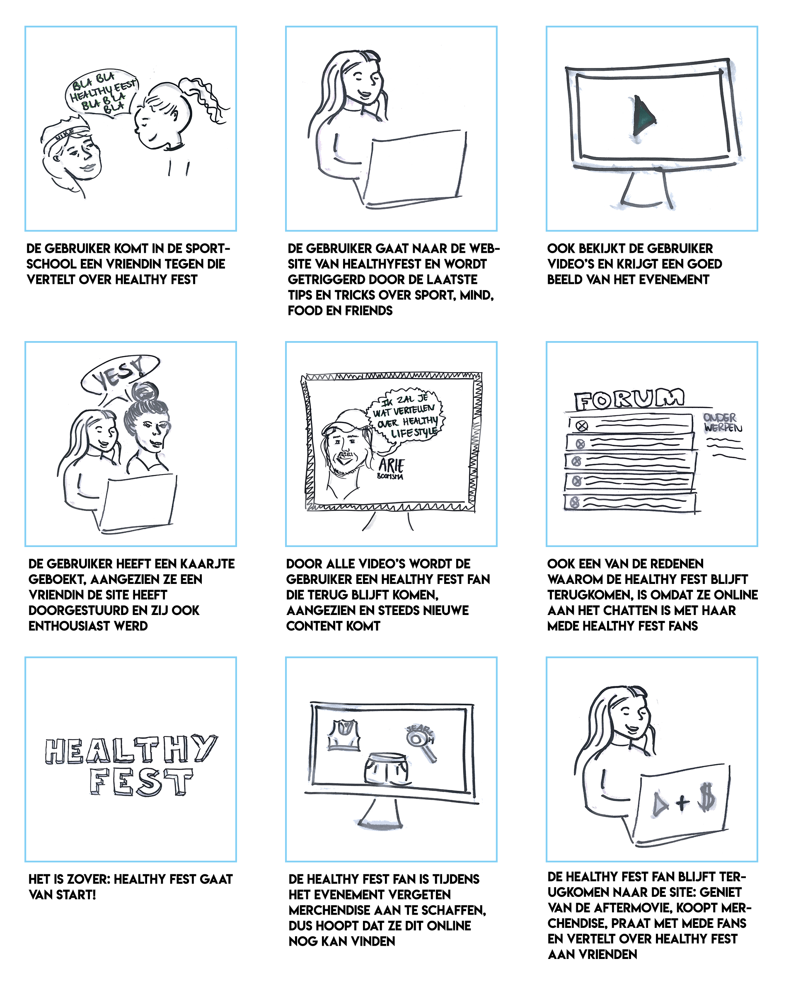

# User Stories

Met de nieuwe doelgroep de "Healthy Fest Fan" vind ik het belangrijk om een duidelijk visueel beeld te krijgen van de scenario's waarin het platform een rol gaat spelen. In de user story worden de behoeften van de gebruiker benoemt en kan ik mij beter inbeelden wat ik eventueel qua content op de website kan inzetten.

### “Als Healthy Fest Fan wil ik het gehele jaar worden bezig zijn met sport, mind, food en friends en kijk ik uit naar het volgende evenement.”

