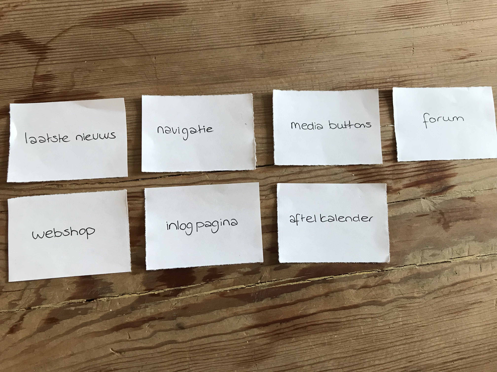
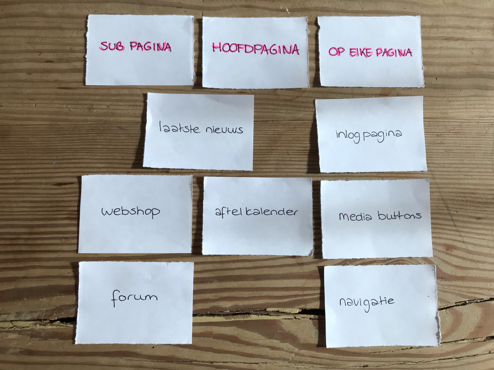
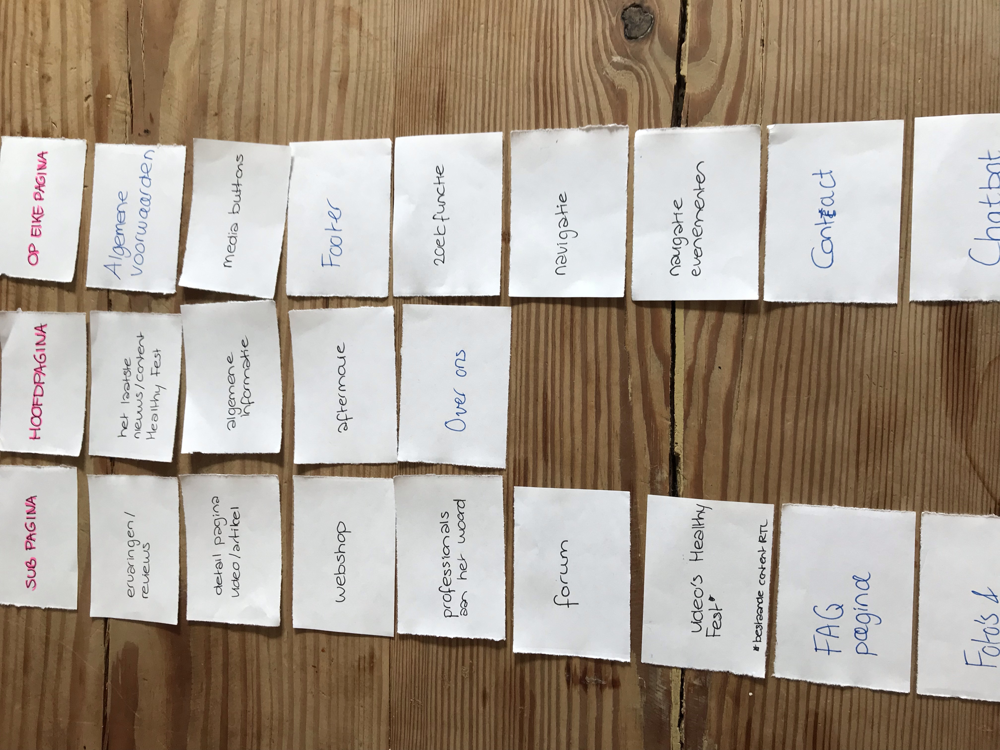
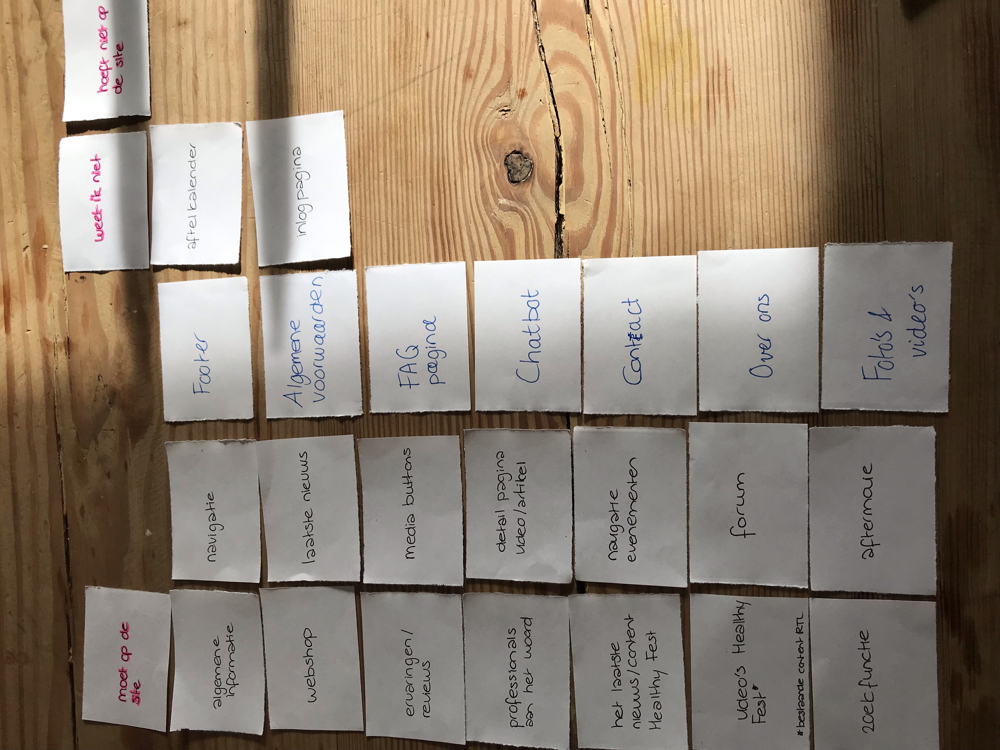
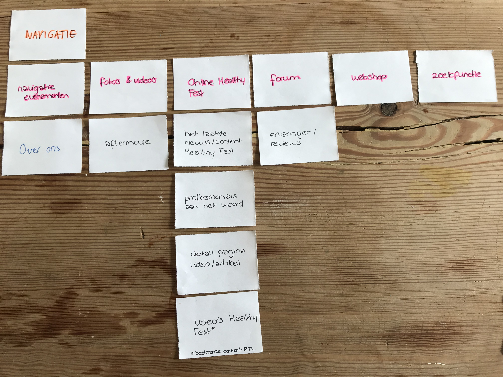
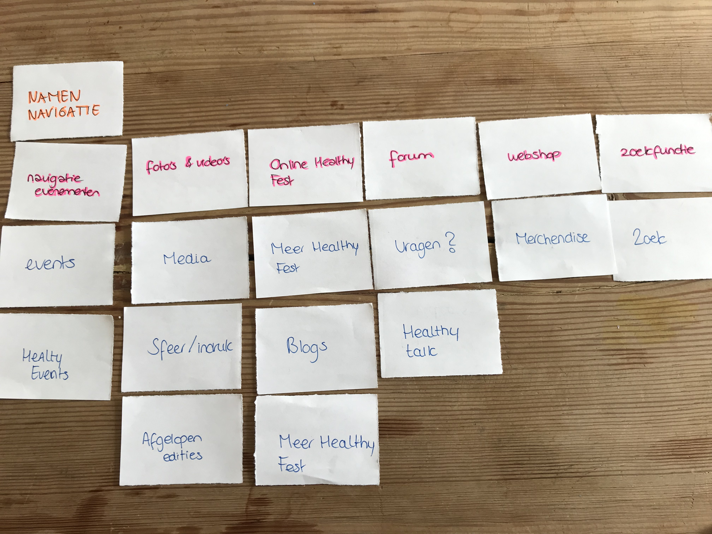

# 3.4 \| Onderzoeksvraag 4

### "Op welke manier kunnen de behoeften van de stakeholders en gebruikers op het nieuwe platform ondersteund worden?"

  
In mijn onderzoek heb ik naast een [persona,](https://productbiografie-isabelle.gitbook.io/productbiografie/fase-2-analyse/onderzoeksmethoden/personas) ook een [stakeholderanalyse](https://productbiografie-isabelle.gitbook.io/productbiografie/fase-2-analyse/onderzoeksmethoden/stakeholderanalyse) opgesteld. In de Design brief die te vinden is in fase 1 van mijn Productbiografie is de [stakeholderanalyse](https://productbiografie-isabelle.gitbook.io/productbiografie/fase-2-analyse/onderzoeksmethoden/stakeholderanalyse) te vinden \(weergegeven als 'Stakeholderanalyse 0.9'\). In een verder stadium van mijn onderzoek heb ik deze bovenstaande onderzoeksvraag pas gaan toevoegen. Vervolgens ben ik een nieuwe [stakeholderanalyse](https://productbiografie-isabelle.gitbook.io/productbiografie/fase-2-analyse/onderzoeksmethoden/stakeholderanalyse) gaan maken. Ik kwam erachter dat ik weinig kon halen uit mijn oude [stakeholderanalyse](https://productbiografie-isabelle.gitbook.io/productbiografie/fase-2-analyse/onderzoeksmethoden/stakeholderanalyse) en dat door de gesprekken met mijn opdrachtgever de informatie ook verandert was.   
  
In de herziende [stakeholderanalyse](https://productbiografie-isabelle.gitbook.io/productbiografie/fase-2-analyse/onderzoeksmethoden/stakeholderanalyse) is onder andere te lezen dat er nog maar 3 belangrijke stakeholders zijn. RTL Live Entertainment, de Healthy Fest Fan en ikzelf. Verder kun je lezen wat elke stakeholder wil en ook belangrijk: wat hebben ze gemeen.   
Een van de behoeftes die de stakeholders met elkaar gemeen hebben, is het zien van content. De gebruiker in de vorm van blogs, video’s, ervaringen/reviews, de aftermovie en bijvoorbeeld het zien van de professionals. Daarin kan RTL Live Entertainment op inspelen, aangezien ze veel van de content al hebben. Verder heeft RTL Live Entertainment weinig behoeftes, waardoor ik mijn project kan gaan storten op de behoeftes van de gebruiker en mijzelf.  
  
Na het maken van een nieuwe [stakeholderanalyse](https://productbiografie-isabelle.gitbook.io/productbiografie/fase-2-analyse/onderzoeksmethoden/stakeholderanalyse) en de inzichten wat ze allemaal gemeen hebben, heb ik een card sorting sessie gehouden. In mijn vraagstelling in de enquêtes en het interview ben ik erachter gekomen dat ik regelmatig de vraagstelling naar de ideeën van mijn opdrachtgever leidt. In de card sorting kom ik tot creatievere ideeën die mij gaan leiden tot een ontwerp rekening houdend met alle stakeholders.  
Vanuit deze card sorting sessie ben ik tot verschillende inzichten komen. Ik weet welke onderwerpen ik nog meer kan toevoegen in de website en welke onderwerpen er op welke pagina/navigatie komen. De volgende onderwerpen wil ik gaan toevoegen in de website:  

* Ervaringen/reviews
* Detail pagina video/artikel
* Webshop
* Professionals aan het woord
* Forum
* FAQ pagina
* Foto's en video's
* Laatste nieuws/content Healthy Fest
* Algemene informatie
* Aftermovie
* Over ons
* Algemene voorwaarden
* Media buttons
* Footer
* Zoekfunctie
* Navigatie
* Navigatie evenementen
* Contact
* Chatbot

Van deze onderwerpen ga ik inspiratie opdoen op internet. Ik ga voorbeelden opzoeken, om te kijken hoe ik deze onderwerpen wil implementeren op de website. Vanuit deze card sorting sessie ga ik dus verder op de inspiratie, maar dit gaat mij ook helpen om de sitemap te maken en zo uiteindelijk tot een concept te komen.   
De uitkomsten van de card sorting sessie heb ik besproken Vicky van der Spoel, de opdrachtgeefster van RTL. Ze was het op zich eens met de bovenstaande onderwerpen en de sortering. Ze was het er mee eens dat de ervaringen/reviews. Op het forum komen vanzelf de ervaringen en de reviews. De indeling van de online Healhy Fest ziet zij graag in 2 onderwerpen: tips/tricks en de professionals aan het woord. Het laatste nieuws zou zij plaatsen op de homepagina, aangezien dat meteen aantrekt op die locatie.



## **Wie zijn mijn stakeholders?**

**RTL**  
In de productvisie is al te lezen dat ****RTL het plan heeft om Healthy Fest groter te maken. In 2018 heeft Healthy Fest twee nieuwe evenementen bedacht: Healthy Fest Hotel en Coast to Coast. Begonnen met alleen Healthy Fest weekend, is Healthy Fest nu al uitgegroeid tot een van de grootste sportevenementen van het jaar. 

Zij willen dat Healthy Fest haar doelgroep moet voorzien van op maat gemaakte content die hen interesseert, op een plek waar deze ook goed ontvangen kan worden. Op een social mediaplatform als Facebook gaat dit niet, omdat hier vaak alleen recente content zichtbaar is. Healthy Fest zal haar content specifiek moeten onderbrengen onder de pijlers sport, mind en food en zal het sorteren op video en tekst. Navigeren wordt voor de gebruiker makkelijker. De nieuwe site van Healthy Fest moet een redactionele formule bevatten, dus content over diverse onderwerpen. Websites als LINDA of 538 zijn goede voorbeelden van hoe een site als Healthy Fest er in de toekomst uit zou kunnen zien. Deze sites hebben een goede navigatiestructuur met gestructureerde content.   
  
**Healthy Fest Fan**  
Naar aanleiding van het maken van de Job Stories, ben ik erachter gekomen dat ik mij op 1 doelgroep ga richten: de Healthy Fest Fan. Uit de [interviews](https://productbiografie-isabelle.gitbook.io/productbiografie/~/edit/drafts/-LZZYBeaqU9MpxPvrrog/fase-2-analyse/onderzoeksmethoden/interviews) blijkt dat zij behoefte hebben om te switchen naar andere events op de website. Ook hebben ze behoefte naar het zien van de doelgroep en de ervaring van de bezoekers én behoefte om professionals te zien op de website. Uit de enquêtes blijkt dat 74,5% van de respondenten het interessant vinden om van te voren te weten wie de doelgroep is wanneer ze een evenement gaan bezoeken. Ook willen ze graag ervaringen/reviews weten voorafgaand aan het evenement, algemene informatie zien, persoonlijk contact met het event hebben, het zien van een aftermovie en de mogelijkheid tot het kopen van merchandise.

Ook hebben de respondenten behoefte om blogs/video's te bekijken over sport/gezondheid en met andere mensen te praten over sport/gezondheid. De respondenten hebben met een grote meerderheid \(46,4%\) beantwoord om meer te leren over sport/gezondheid en geven en aan veel artikelen op te zoeken over sport, mind, food en friends. De respondenten hebben dus behoefte aan de content die Healthy Fest al op diverse kanalen post.  
  
**Fjuze**  
Na een gesprek met Vicky van der Spoel \(werknemer RTL Live Entertainment\) ben ik erachter gekomen dat ik geen rekening hoef te houden met Fjuze in mijn advies.  
  
**Ik**  
Als stakeholder wil ik graag dat het platform van Healthy Fest gaat helpen om een groter bereik te hebben qua Healthy Fest Fans. Ik wil een passend advies kunnen geven, door veel te halen uit onderzoek op het internet en het bestuderen van het gedrag en de behoeftes van de doelgroep en mijn opdrachtgever.

## **Wat hebben mijn stakeholders met elkaar gemeen?** 

Een van de behoeftes die de stakeholders met elkaar gemeen hebben, is het zien van content. De gebruiker in de vorm van blogs, video's, ervaringen/reviews, de aftermovie en bijvoorbeeld het zien van de professionals. Daarin kan RTL Live Entertainment op inspelen, aangezien ze veel van de content al hebben. Verder heeft RTL Live Entertainment weinig behoeftes, waardoor ik mijn project kan gaan storten op de behoeftes van de gebruiker en mijzelf. 


Na het maken van een nieuwe stakeholderanalyse en het zien wat ze allemaal gemeen hebben, ga ik een card sorting sessie houden met mijn doelgroep. In mijn vraagstelling in de enquêtes en het interview ben ik erachter gekomen dat ik regelmatig de vraagstelling naar de ideeën van mijn opdrachtgever RTL Live Entertainment leidt. In de card sorting kom ik tot nieuwere, creatievere ideeën. 




In de persona kun je zien dat ze geinteresseerd is in sport, bewust is en alles uit het leven wil halen. Ze probeert om de hele week bewust te zijn, maar dit lukt niet altijd. Ze wil altijd op de hoogte zijn van de laaste ontwikkelingen en is redelijk extrovert, actief, bewust en sterk. 




De card sorting sessie heb ik gehouden met twee deelnemers die naar Healthy Fest zijn gegaan. Dit gaat om Rebecca Weststrate \(31 jaar\) en haar vriend Dennis van Essen. Zij zijn in juni 2018 naar Healthy Fest geweest.

In het eerste deel van de sessie heb ik 7 onderwerpen op losse blaadjes geschreven, die naar voren zijn gekomen uit de methodes in de analyse fase.

Ik wilde graag weten op welke pagina's de deelnemers graag de onderwerpen zien. Hierin heb ik een onderscheid gemaakt tussen een subpagina, hoofdpagina en welk onderwerp op elke pagina moet terugkomen. Hieruit werd duidelijk dat ze twijfelden op welke pagina het laatste nieuws moest komen, waardoor de conclusie kwam dat het zowel op de hoofdpagina als op een subpagina kan voorkomen. Het kan dus zo zijn dat het laaste nieuws op de hoofdpagina voorkomt en vervolgens doorlinkt naar een sub-pagina.  

De opdracht die de deelnemers vervolgens kregen, was om meer onderwerpen te bedenken die op de website van Healthy Fest moeten voorkomen. Door de toevoegingen van de deelnemers, heb ik zelf ook weer onderwerpen toegevoegd. 

Ik wilde erachter komen of alle nieuwe \(en oude\) onderwerpen gewenst zijn op de pagina. Daarom heb ik de onderwerpen verdeeld in 'Moet op de site", 'Weet ik niet' en 'Hoef niet op de site. In principe wilden de deelnemers alles op de pagina, behalve de aftelkalender en de inlogpagina. 

Wat ik ook interessant is om te weten, is om te kijken welke onderwerpen er in de navigatie horen. Hieruit kwamen de volgende onderwerpen: navigatie evenementen, over ons, foto's en video's, forum, webshop en de zoekfunctie. 

Vervolgens heb ik gevraagd om de onderwerpen te verdelen over de navigatie. Welke onderwerpen horen er bij welke navigatie? Er werd hier gezegd dat over ons geen eigen navigatie nodig heeft, maar kan vallen onder het navigatie kopje 'navigatie evenementen'. 

Tot slot vond ik het interessant om te kijken of de deelnemers andere namen hadden voor de navigatie koppen. De andere namen voor de navigatie balk ga ik voorleggen bij de opdrachtgever RTL Live Entertainment tijdens mijn interview met Vicky van der Spoel. 

**Conclusie**

Vanuit deze card sorting sessie ben ik tot verschillende inzichten komen. Ik weet welke onderwerpen ik nog meer kan toevoegen in de website en welke onderwerpen er op welke pagina/navigatie komen. De volgende onderwerpen wil ik gaan toevoegen in de website:

* Ervaringen/reviews
* Detail pagina video/artikel
* Webshop
* Professionals aan het woord
* Forum
* FAQ pagina
* Foto's en video's
* Laatste nieuws/content Healthy Fest
* Algemene informatie
* Aftermovie
* Over ons
* Algemene voorwaarden
* Media buttons
* Footer
* Zoekfunctie
* Navigatie
* Navigatie evenementen
* Contact
* Chatbot

Van deze onderwerpen ga ik inspiratie opdoen op internet. Ik ga voorbeelden opzoeken, om te kijken hoe ik deze onderwerpen wil implementeren op de website. Vanuit deze card sorting sessie ga ik dus verder op de inspiratie, maar dit gaat mij ook helpen om de sitemap te maken en zo uiteindelijk tot een concept te komen.  
  
Ten slotte heb gebruik gemaakt van de gelegenheid om te vragen of ze behoefte hebben aan  een website van Healthy Fest met de onderdelen die ze zelf hebben gekozen. Ze gaven hier aan dat Healthy Fest bij hun thuis en bij hun vrienden vaak een gesprekonderwerp is. Hieruit hebben ze zelf geconcludeerd dat niet alleen zij, maar ook hun vrienden gebruik willen maken van de website. 

De uitkomsten van de card sorting sessie heb ik besproken Vicky van der Spoel, de opdrachtgeefster van RTL. Ze was het op zich eens met de bovenstaande onderwerpen en de sortering. Ze was het er mee eens dat de ervaringen/reviews. Op het forum komen vanzelf de ervaringen en de reviews. De indeling van de online Healhy Fest ziet zij graag in 2 onderwerpen: tips/tricks en de professionals aan het woord. Het laatste nieuws zou zij plaatsen op de homepagina, aangezien dat meteen aantrekt op die locatie.   
  
Ze wil graag een contactpagina op de website van Healthy Fest die is toegevoegd aan de navigatie. Hier moet dan het emailadres van Healthy Fest op staan en Healthy Fest Fans kunnen hier vragen stellen.   
   
De keuze van de namen ziet zij het liefste als volgende:  
  
**Navigatie evenementen:**  
Healthy Events  
  
**Foto's en video's**  
Afgelopen edities

**Online Healthy Fest**  
Meer Healthy Online

**Forum**  
Healthy Talk  
  
**Webshop  
  
Contact**

  
-



