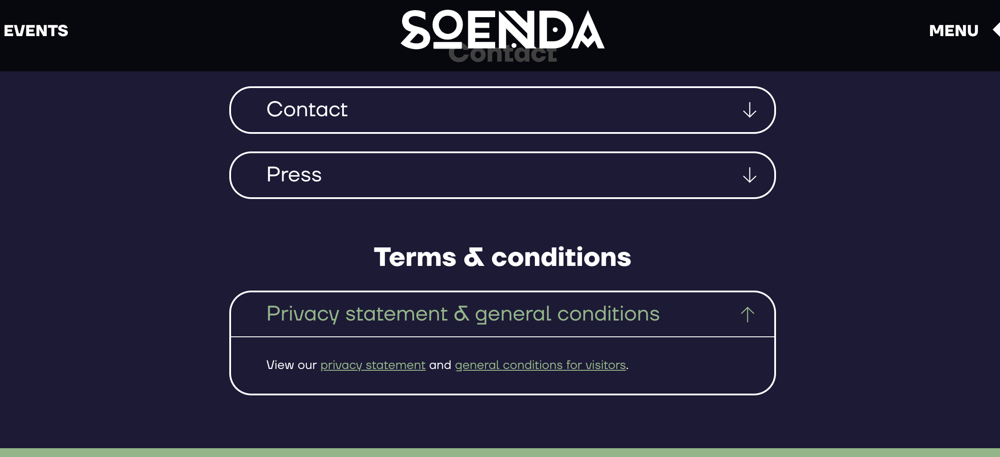
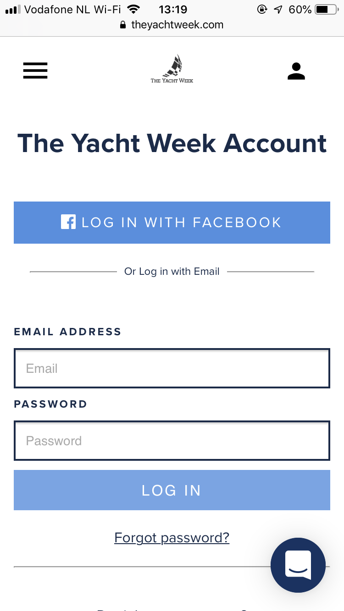
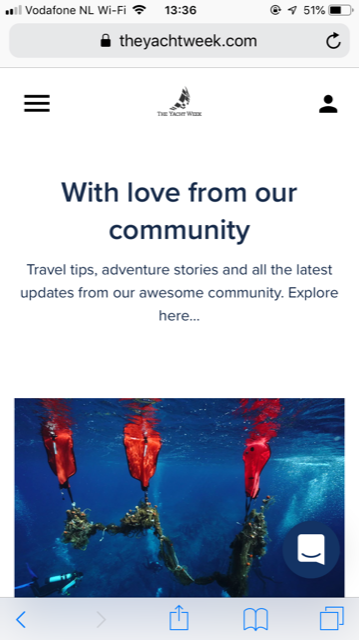
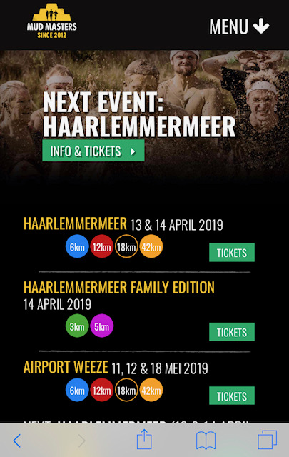
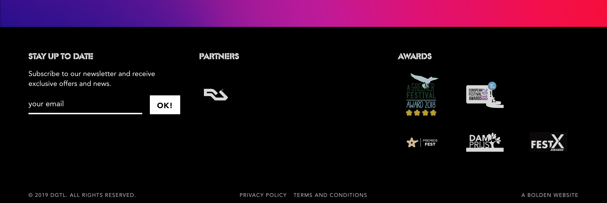

# Inspiratie

Vanuit de analyse fase zijn er verschillende onderwerpen gekozen, die in de nieuwe website moeten komen. Voor deze onderwerpen ga ik inspiratie opzoeken op het internet, om te kijken hoe andere websites deze onderwerpen implementeren. Dit gaat mij helpen om de schetsen te maken. Het gaat om de volgende onderwerpen:

* Aftelkalender 
* Inlogpagina 
* Ervaringen/reviews
* Detail pagina video/artikel 
* Webshop -
* Professionals aan het woord - 
* Forum 
* FAQ pagina 
* Foto's en video's 
* Laatste nieuws/content Healthy Fest 
* Algemene informatie 
* Aftermovie 
* Over ons 
* Algemene voorwaarden 
* Media buttons 
* Footer 
* Zoekfunctie 
* Navigatie
* Navigatie evenementen 
* Contact 
* Chatbot 























































































  
**Onderzoek n.a.v. interview 3**  
  
Uit het interview met Vicky van der Spoel \(interview 3\), waarin ik het eerste prototype aan haar liet zien, ben ik erachter gekomen dat ik het een en ander wil veranderen/toevoegen aan de website. Daardoor ga ik inspiratie opdoen naar de volgende onderwerpen:  
  
1. Andere naam voor foto's & aftermovie\(s\)  
2. Een optie op de website om de events meer uit te lichten \(de Healthy events moeten belangrijker worden op de website\)  
3. Ticket verkoop stimulatie door website heen















Uit de bovenstaande inspiratie is gekeken naar verschillende features op \(vaak\) concurrerende websites. Ik ben dus gericht features gaan zoeken op bepaalde websites.   
  
Ik vind dat er uit bovenstaand onderwerp geen duidelijk overzicht komt welke features handig zijn om toe te voegen. Om tot een beter ontwerp te komen, wil ik mij meer richten op concurrerende websites en ga ik bekijken welke features de concurrenten hebben.   
  
Om de features van de concurrenten in een duidelijk overzicht te krijgen en ze met elkaar te vergelijken, is er een Comparison Chart opgesteld. Nu moest ik de concurrenten compleet doorlopen om alle features te vinden. Ik ben begonnen met alle features die ik heb gehaald uit de Analyse fase. Wanneer er features te zien zijn op een website die ik nog niet onderzocht heb, heb ik deze toegevoegd in de tabel.   

   
Het gaat om de volgende websites:  
  
- Yachtweek  
- Vakantiebeurs  
- Mudmasters  
- Digital  
- TT circuit assen  
- Strong Viking  
- Max Verstappen  
- Extrema  
- Tomorrowland  
- Diynamic  
- Marine Marathon  
- Soenda  
- Paaspop  
- Neverland Outdoor  
- Appelpop  
  



   



 



 



 



 



 



 





 



 



 



 



 



 



 



 



