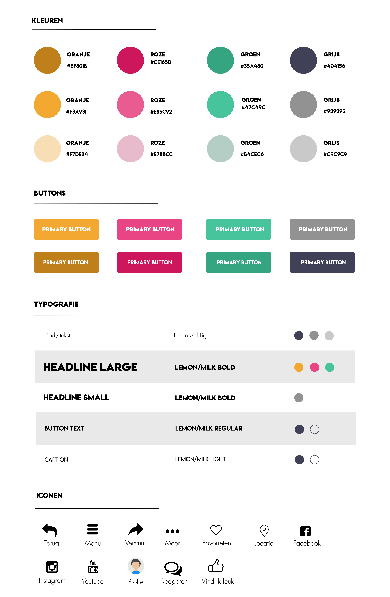

# Huisstijl











**Keuzes styleguide 0.8 en 0.9**  
  
Kleuren  
  
_Oranje_  
[In een artikel op Frankwatching](https://www.frankwatching.com/archive/2015/02/17/wat-zijn-goede-kleuren-voor-je-website-checklist/) staat dat oranje de kleur is die staat voor warmte, veiligheid, passie en plezier. Ook wordt de kleur geassocieerd met fysiek comfort en eten. Oranje is een stimulerende kleur en zorgt zowel voor fysieke als emotionele reacties. Bovendien richt oranje onze gedachten op fysiek comfort zoals voedsel, warmte en onderdak.  
  
_Roze_  
[Ook staat er dat](https://www.frankwatching.com/archive/2015/02/17/wat-zijn-goede-kleuren-voor-je-website-checklist/) Roze wordt gezien als een romantische kleur en als een vrouwelijke kleur. Roze staat ook voor liefde, warmte, voeden en rust. Roze is een kleur die een fysiek effect met zich meebrengt. Echter is dit fysieke effect wel eerder rustgevend dan stimulerend waardoor roze niet aanspoort tot actie.  
  
_Groen_  
[Groen wordt vaak gezien](https://www.frankwatching.com/archive/2015/02/17/wat-zijn-goede-kleuren-voor-je-website-checklist/) als de kleur van balans, verfrissing, herstel, gezondheid en evenwicht. Bovendien roept groen associaties op met milieuvriendelijkheid, gerustheid en vrede. Groen is dan ook een ontspannende kleur waarmee positiviteit wordt opgewekt. Groen is, doordat de kleur in het midden van het spectrum komt, bovendien de kleur die het makkelijkst door je ogen verwerkt kan worden.  
  
_Grijs_  
Grijs staat [volgens het artikel ](https://www.frankwatching.com/archive/2015/02/17/wat-zijn-goede-kleuren-voor-je-website-checklist/)voor neutraliteit en is de kleur die het minst psychologische effecten met zich meebrengt. Door teveel grijs te gebruiken kan de kleur zelfs deprimerend werken, waardoor de kleur een remmend effect kan hebben. Daarom moet ik ervoor zorgen dat grijs niet de overhand gaat hebben.

**Verandering keuze blauw i.p.v. roze**

Uit het doelgroeponderzoek bleek dat meerendeel van de doelgroep bestaat uit vrouwen. Aangezien er uit het interview met Vicky van der Spoel kwam dat de opdrachtgever toch liever geen roze ziet in de huisstijl van Healthy Fest, omdat het uit onderzoek komt dat roze staat voor vrouwelijkheid. Roze spoort ook niet aan tot actie, waardoor er gekozen is voor een andere kleur.  
  
_Blauw_  
[Uit het artikel van Frankwatching](https://www.frankwatching.com/archive/2015/02/17/wat-zijn-goede-kleuren-voor-je-website-checklist/) blijkt blauw een intellectuele kleur is en staat voor betrouwbaarheid, loyaliteit, oprechtheid en effectiviteit. Ook heeft blauw associaties met communicatie, logica en koelte. Blauw is een kleur die, in tegenstelling tot het fysieke effect van rood, een mentaal effect heeft. Een donkere variant van blauw stimuleert helder denken, terwijl een lichte variant van blauw de concentratie bevordert. Blauw is bovendien wereldwijd de favoriete kleur.

[In dit artikel](https://www.happyidiots.nl/blog/wat-voor-invloed-hebben-kleuren-op-ons-brein-en-hoe-pas-je-dit-toe-voor-je-website/) staat wat voor invloed kleuren hebben op ons brein en hoe dit wordt toegepast voor je website. Daaruit blijkt uit een onderzoek van [Kissmetrics](https://blog.kissmetrics.com/gender-and-color/) dat blauw de meest geliefde kleur is van alle ondervraagden. Namelijk 57% van de mannen en 35% van de vrouwen, geeft aan dat blauw hun favoriete kleur is.

De kleuren zijn tijdens het maken van het prototype op een kleine tint na nog aangepast. Ik ben zoveel mogelijk gebleven bij de kleuren uit de styleguide 1.0 

