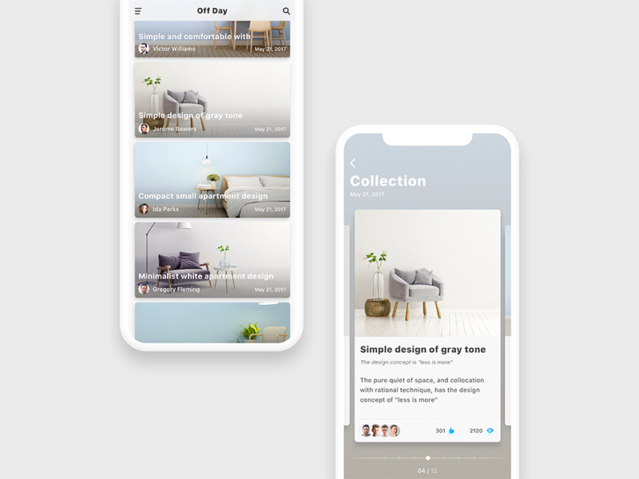
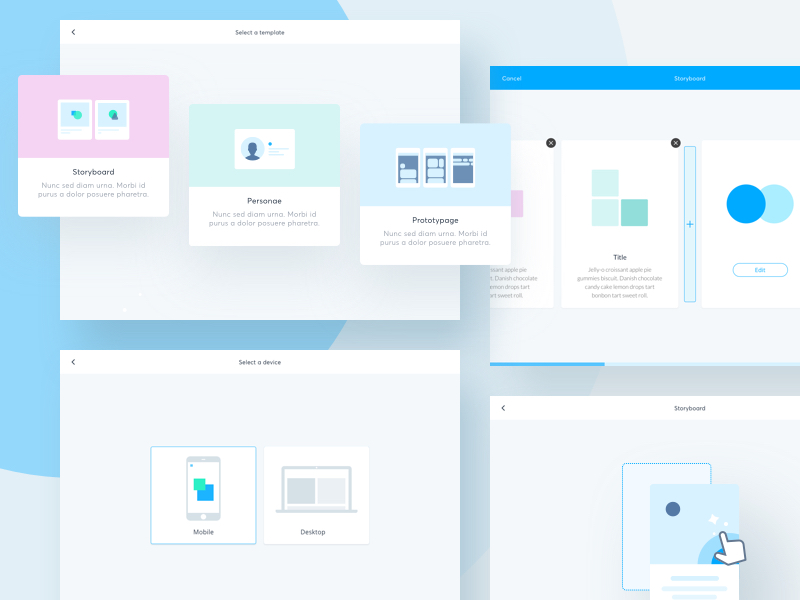
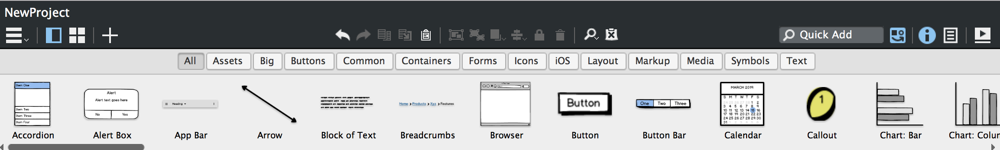
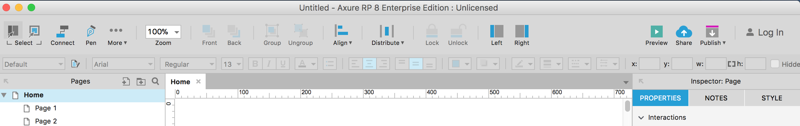
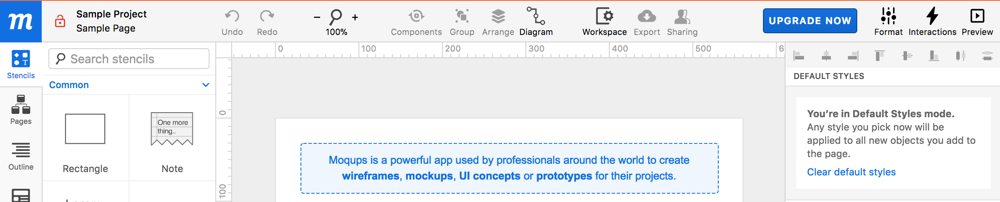
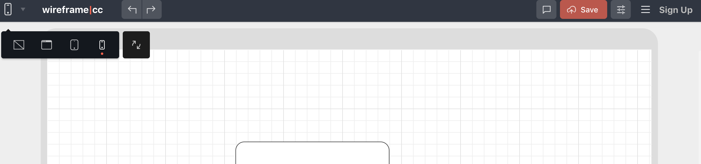
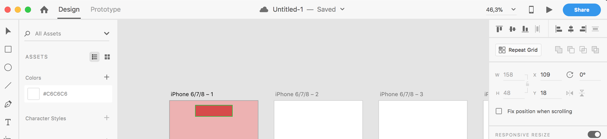

# Onderzoek UX UI & Prototype tool

### Onderzoek UX 

UX Design is belangrijk om mee te nemen in het ontwerp voor het platform van Healthy Fest. Het doel is om zo gebruiksvriendelijk mogelijk de gebruiker door je website te begeleiden. Daarom heb ik een aantal artikelen opgezocht en daar de belangrijkste punten uitgehaald, om mijn website zo gebruiksvriendelijk te maken. Als het product voor de gebruiker op een positieve manier waarde creëert, dan ben je geslaagd in de user experience.

[In een artikel van Pixel Industries over 5 kenmerken van UX Design vriendelijke website](https://pixelindustries.com/nl/blog/5-kenmerken-van-een-ux-designvriendelijke-website/) heb ik een aantal onderwerpen gelezen, die ik in mijn ontwerp niet moet vergeten. 

Hier staat dat gebruikers intussen gewend zijn dat zij door het aanklikken van je logo automatisch worden redirect naar jouw homepage. Wanneer dit niet het geval is, moet men dus een extra handeling verrichten.  
  
Ook staat er dat de ‘flow’ van een hoofdnavigatie niet meer dan twee klikken bevat. Na de tweede klik zou men zich al bijvoorbeeld op een check-out pagina moeten bevinden. Niets is irritanter dan dat je eerst tien pagina’s moet door scrollen om uiteindelijk je bestelling te plaatsen. Probeer het zo makkelijk mogelijk te maken voor de gebruiker door een herkenbaar menu en menu titels te gebruiken.

Verder staat er dat bezoekers aan je website lezen teksten erop globaal en scannend. Net zoals we vroeger \(en soms nog steeds\) deden met de ouderwetse krant. Wanneer het één lap tekst is om door te lezen, zal de gebruiker dit stuk overslaan. Dat is zonde, want je wil de gebruiker juist zo lang mogelijk op jouw website houden. Door het gebruik van hyperlinks in een andere kleur of onderstreept te weergeven, kun je de gebruiker doorlinken naar andere gerelateerde berichten binnen jouw website, maar dan moeten ze wél opvallen.

Tot slot staat er in het artikel dat er heel veel iconen te vinden zijn op het internet. Niets is lelijker dan verschillende iconen door elkaar te gebruiken. Daarnaast wil de gebruiker juist steeds dezelfde iconen herkennen. Gebruik dus altijd dezelfde iconen-set op herkenbare plekken in je website.


Conclusie:  
- Aanklikken van logo -&gt; direct naar homepage  
- Herkenbaar menu en menutitels gebruiken  
- Hyperlinks in een andere kleur of onderstreept weergeven  
- Dezelfde iconen-set op herkenbare plekken


[In een artikel op Frankwatching over UX tips die je website future proof maken](https://www.frankwatching.com/archive/2015/07/09/5-ux-tips-die-je-merk-future-proof-maken/) staat dat een goed voorbeeld van UX geoptimaliseerde websites [Uber](https://www.uber.com/) of [Airbnb](https://www.airbnb.nl/) zijn. Deze sites voelen letterlijk als thuiskomen. De interfaces van deze websites zijn ontworpen om de gebruiker volledig te ontzorgen. De juiste content op het juiste moment. Er is een duidelijke focus op de belangrijkste taak van de bezoeker en alle touchpoints zijn hierop ingericht. 

De website van [Cool Hunting](http://www.coolhunting.com/) is een voorbeeld van een landingspagina uit het boekje. Hun redesign is er op gericht om het de gebruiker zo makkelijk mogelijk te maken zonder dat het ten koste gaat van het visual design.  
  
De website van [Virgin America](https://www.virginamerica.com/) is ook een goed voorbeeld van een platform met een interface die erop gericht is om de bezoeker de beste ervaring te bieden. Innovatief design en handige functionaliteiten zijn hier key.

### Onderzoek UI

UI is de afkorting voor User Interface. Ik gebruik UI in mijn ontwerp door de mijn ontwerp visueel aantrekkelijk te maken op een manier hoe het werkt voor de gebruiker en waar de elementen geplaatst worden.

[In een artikel op UX design over 9 essentiële design trends die je niet moet vergeten](https://uxdesign.cc/9-essential-ui-design-trends-you-should-stick-to-in-2018-26f33d1fe980) staat dat kleuren die overgaan in andere kleuren een trend zijn, dit kun je bijvoorbeeld goed zien op de website van [Spotify](https://www.spotify.com/uk/?utm_source=spotify&utm_medium=web&utm_campaign=start) en [Symmod](http://www.symodd.com/).   
  
Ook staat er in het artikel dat video's content is die belangrijk is op je website. Zorg ervoor dat je er altijd voor zorgt dat de gebruiker video's kan delen via hun eigen social media kanalen aan vrienden. 

Over de kleuren zegt het artikel dat er minder gebruik moet worden gemaakt van felle kleuren en meer de pastel tinten gebruikt moeten worden. Inspiratie hiervan heb ik bekeken op Dribble en daar kwamen onderstaande inspiratie afbeeldingen uit:

###  Onderzoek prototype tool 

**Balsamiq**  
[Balsamiq](https://balsamiq.com/) is een van de bekendste prototyping tools op de markt, met een focus op het maken van wireframes. Deze tool beschikt over verschillende tekstblokken, formulieren, navigatie elementen etc. om zo de website te visualiseren. 

+ Makkelijk in gebruik   
+ Duidelijke interface  
+ Eenvoudig commentaar toevoegen  
  
- Bij het exporteren komen alle pagina's onder elkaar, geen overzichtelijk klikbaar prototype van te maken  
- Na 30 dagen betalen  
- Alleen geschikt in vroege ontwikkelfase  
  
**Axure**

De [Axure](https://www.axure.com/) mock-up- en wireframe-tool is geschikt voor zowel simpele wireframes als meer gedetailleerde prototypes. Axure heeft een uitgebreide mogelijkheid aan gebruikersfuncties.

  
+ Mogelijk om samen aan één project te werken  
+ Maken van animaties  
+ Makkelijk responsive te maken  
  
- Proefperiode van 30 dagen, daarna betalen. Voor studenten gratis, maar voor de toekomst heb ik daar niks aan  
- Je kan geen elementen roteren  
- Aantal simpele mogelijkheden ontbreken

**Moqups**  
[  
****Moqups](https://moqups.com/) is een veelgebruikte mock-up-tool en alleen online te gebruiken. Met Moqups maak je op een snelle en effectieve manier een mock-up. Via dit programma kun je via een duidelijk menu een overzichtelijke structuur maken en is het programma makkelijk te gebruiken.

+ Gebruiksvriendelijk  
+ Makkelijk pagina's aan elkaar te koppelen

- Weinig standaard elementen  
- Maximaal 200 elementen, daarna upgraden \(kost geld\)

Vanuit een selectie van kant-en-klare frames en sjablonen selecteert de gebruiker passende elementen en organiseert en configureert deze naar wens. Moqups valt op door de zeer uitgebreide configuratiemogelijkheden. Dankzij de vele functies, extensies en designmogelijkheden, is zowel het **ontwerp van losse elementen** als het creëren van volledige mockups mogelijk. De mock-up-tool biedt minder standaard elementen dan andere vergelijkbare applicaties, maar heeft daarentegen wel weer veel aanpasbare functies. Ook in Moqups is het mogelijk om meerdere parallelle pagina's te maken en deze aan elkaar te koppelen, en dit maakt de tool zeer geschikt voor het maken van eenvoudige clickdummies van het [website design](https://www.strato.nl/hosting/website-designs/).

**Wireframe cc**  
  
[Wireframe.cc](https://wireframe.cc/) is een programma waarbij je snel en makkelijk simpele wireframes kan maken. Het programma is vrij beperkt, vooral in wat je erin kan voegen. De tool is dus meer geschikt voor echt de beginfase.

+ Makkelijke interface  
+ Makkelijk kiezen tussen verschillende devices  
  
- Voor de premium versie \(waar je meer mee kan\) moet je betalen  
- Alleen geschikt in vroege ontwikkelfase  
- Betalen voor klikbare elementen  
  
**Adobe XD**

Adobe XD CC vind ik een heel fijn programma met intuïtieve tools, wat mijn werk een stuk makkelijker maakt. Het programma is echt puur gericht op het ontwerpen van wireframes, layouts en \(interactieve\) designs van websites en apps.

  
+ Gemakkelijk een klikbaar prototype maken en exporteren  
+ Het programma is makkelijk te downloaden vanuit mijn Adobe account  
+ Veel video's over het gebruik van Adobe XD  
  
- Uitvinden heeft even iets meer tijd nodig  
- Kan alleen op een Mac  
- Bijna geen standaard elementen, die moet je zelf ontwerpen

Uiteindelijk heb ik de schermen gekoppeld in InVision, gezien dit een programma is wat fijn werkt en ik er nooit problemen mee heb.  
 

