# Design Pattern Search

In het eerste Design Pattern Search zocht ik vooral patterns gebaseerd op het maken van een website. Gelukkig ben ik er op tijd achter gekomen dat ik niet veel aan mijn eerste onderzoek ging hebben. Ook naar aanleiding van de uitkomst dat de gebruiker vooral de website bezoekt via de telefoon, ben ik patterns gaan zoeken voor de weergave op de mobiele telefoon. Ik ben design patterns gaan zoeken voor het programma van eisen, zodat ik alle elementen die in het ontwerp moeten komen aanwezig zijn. Sommige patterns hebben uitleg nodig, die dan ook te vinden is bij de bepaalde eis. 



De volgende onderdelen moeten uit onderzoek voorkomen in het nieuwe platform van Healthy Fest. Het onderzoek van de patterns komen van www.ui.patterns.com.   
  
**Patterns uit onderzoek website**  
  
_→ Hoofdpagina_

* [Navigation Tabs](http://ui-patterns.com/patterns/NavigationTabs) \(UI Design Pattern\)
* [Dashboard](http://ui-patterns.com/patterns/dashboard) \(UI Design Pattern\)
* [Slideshow](http://ui-patterns.com/patterns/Slideshow) \(UI Design Pattern\)
* [Module Tabs](http://ui-patterns.com/patterns/ModuleTabs) \(UI Design Pattern\)
* [Breadcrumbs](http://ui-patterns.com/patterns/Breadcrumbs) \(UI Design Pattern\)
* [Fat Footer](http://ui-patterns.com/patterns/FatFooter) \(UI Design Pattern\)
* [Home Link](http://ui-patterns.com/patterns/HomeLink) \(UI Design Pattern\)
* [Vertical Dropdown Menu](http://ui-patterns.com/patterns/VerticalDropdownMenu) \(UI Design Pattern\)

_→ Webshop_

* [ImageZoom](http://ui-patterns.com/patterns/ImageZoom) \(UI Design Pattern\)
* [Product page](http://ui-patterns.com/patterns/ProductPage) \(UI Design Pattern\)
* [Coupon](http://ui-patterns.com/patterns/Coupon) \(UI Design Pattern\)
* [ShoppingCart](http://ui-patterns.com/patterns/ShoppingCart) \(UI Design Pattern\)
* [Scarcity](http://ui-patterns.com/patterns/Scarcity) \(Persuasive Design Pattern\)

  
→ Profielpagina

* [Account Registration](http://ui-patterns.com/patterns/AccountRegistration) \(UI Design Pattern\)

  
→ Laatste nieuws

* [Completeness meter](http://ui-patterns.com/patterns/CompletenessMeter) \(UI Design Pattern\)
* [Table Filters](http://ui-patterns.com/patterns/TableFilter) \(UI Design Pattern\)
* [Gallery](http://ui-patterns.com/patterns/Gallery) \(UI Design Pattern\)
* [Search Filters](http://ui-patterns.com/patterns/LiveFilter) \(UI Design Pattern\)
* [Carousel](http://ui-patterns.com/patterns/Carousel) \(UI Design Pattern\)
* [Cards](http://ui-patterns.com/patterns/cards) \(UI Design Pattern\)
* [Article List](http://ui-patterns.com/patterns/ArticleList) \(UI Design Pattern\)
* [Pagination](http://ui-patterns.com/patterns/Pagination) \(UI Design Pattern\)
* [Archive](http://ui-patterns.com/patterns/Archive) \(UI Design Pattern\)
* [Categorization](http://ui-patterns.com/patterns/categorization) \(UI Design Pattern\)

  
Forum/recensies

* [Testimonials](http://ui-patterns.com/patterns/testimonials) \(UI Design Pattern\)

  
Eventpagina

* [Limited duration](http://ui-patterns.com/patterns/Limited-duration) \(Persuasive Design Pattern\)

**Eventueel interessante gevonden patterns**

* Veelgestelde vragen \(UI Design Pattern\)
* nieuw onderzoek
* [Notifications](http://ui-patterns.com/patterns/notifications) \(UI Design Pattern\)
* nieuw onderzoek
* [Modal Window](http://ui-patterns.com/patterns/modal-windows) \(UI Design Pattern\)
* nieuw onderzoek
* [Collectible Achievements](http://ui-patterns.com/patterns/CollectibleAchievements) \(UI Design Pattern\)
* [Activity Stream](http://ui-patterns.com/patterns/ActivityStream) \(UI Design Pattern\)
* [Follow](http://ui-patterns.com/patterns/follow) \(UI Design Pattern\)
* [Chat](http://ui-patterns.com/patterns/direct-messaging) \(UI Design Pattern\)

  
**Optioneel:**

* Password Strength Meter
* Input Feedback
* Good defaults

  
**Navigatie**

\*\*\*\*

De navigatie komt bovenin de website, aangezien ik verschillende content wil laten zien. Laatste nieuws, forum, de events en jouw eigen inlog pagina. 



Design patterns zijn herhaalbare oplossingen voor veel voorkomende design problemen. Door deze te onderzoeken, kan ik kijken welke ik kan toepassen in mijn product. Zo wordt het voor mij makkelijker om oplossingen te bedenken voor alle eisen.

Per eis heb ik design patterns onderzocht via de website [UI Patterns](http://ui-patterns.com/patterns).  

### Eis 1/29 \| Het platform moet foto's en video's laten zien van de afgelopen edities, om de gebruikers een indruk te geven van het evenement

**Carousel**  
Bij deze Design Pattern moet de gebruiker door een reeks items bladeren en kan mogelijk een van de items selecteren. De design pattern kan worden gebruikt wanneer er een groot aantal items moet worden laten zien, maar er maar beperkt ruimte is. De pattern ga ik dus gebruiken tijdens het laten zien van de foto's van de evenementen. Zo kunnen alle foto's getoond worden en kan de gebruiker selecteren welke foto hij of zij wil zien door erop te klikken. 

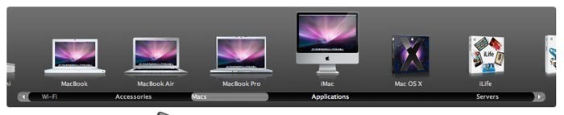

### Eis 2/29 \| Het platform moet blogs/video's tonen aan de gebruiker op het gebied van sport, mind, friends en food

**Morphing controls**   
Morphing controls is een oplossing die gebruikt wordt om een bepaalde actie uit of aan te zetten. In het voorbeeld hieronder van Twitter zie je eerst dat de gebruiker dit account kan followen, en wanneer je er weer op klikt, volg je het account niet meer.  

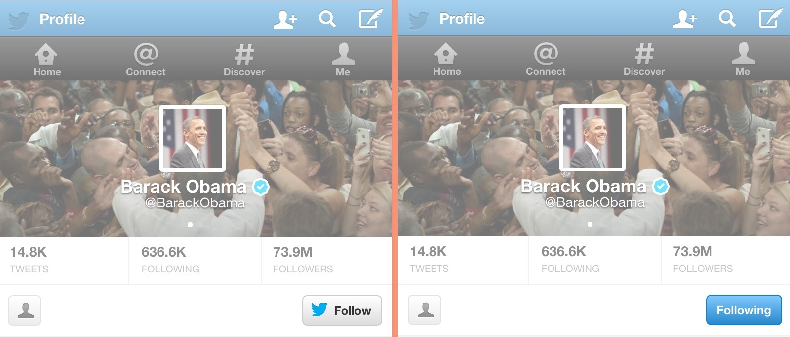

Als gebruikers aan kunnen geven wanneer zij klaar zijn om een user story in te schatten, moeten zij ook de mogelijkheid krijgen om dit ongedaan te maken als zij hier per ongeluk op klikken. Morphing controls zijn hiervoor geschikt. Zo kun je een knop tonen waarmee je kunt aangeven dat je klaar bent om in te schatten. Ik kan morphing controls gebruiken bij mijn artikelen en video's over sport, mind, friends en food. Als de gebruiker is ingelogd, kan de gebruiker zich 'abonneren' op een bepaald onderwerp. De morphing controls kan ik gaan gebruiken in combinatie met de trigger. 

**Trigger**  
Een trigger geeft de gebruiker een extra zetje. Dit kan bijvoorbeeld in de vorm zijn van een notificatie, tweets of emails. Ik kan de trigger gebruiken door bijvoorbeeld een notificatie te laten versturen door middel van het gebruik van morphing controls. Hierdoor krijgt de gebruiker een mail dat er weer een nieuw artikel beschikbaar is en wordt de gebruiker dus getriggerd om weer een nieuw artikel te lezen. 

### Eis 3/29 \| Het platform moet een plek creëren waar de merchandise gekocht kan worden door de gebruiker

**Fixed rewards**  
Deze Design Pattern gebruikt beloningen om de voortzetting of introductie van gewenst gedrag aan te moedigen. Gebruik  de vaste beloningen wanneer er een specifiek doel is bereikt.   
Ik kan fixed rewards gebruiken bij de webshop, door een korting aan te bieden voor een artikel op de webshop wanneer er een kaartje wordt gekocht voor een van de evenementen. 

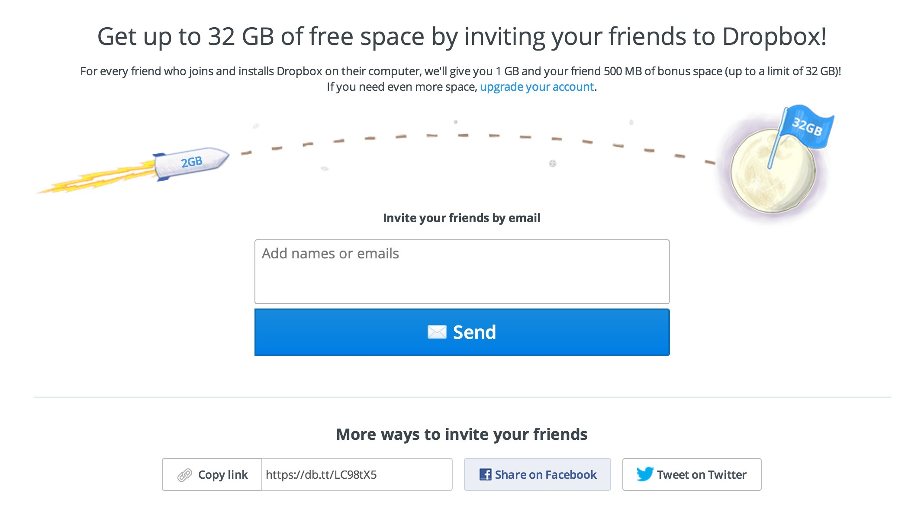

**Scarcity**

Deze design pattern wordt ingezet als dat een artikel schaars is, dan ziet de gebruiker het vaker als wenselijker en waardevoller. De pattern wordt gebruikt als er een gevoel van exclusiviteit moet worden overgedragen of als de inkoop moet worden gestimuleerd. Aangezien ik Healthy Fest Fans wil creëren, is het belangrijk om merchendise te verkopen. Daarom kan ik in de webshop scarcity toevoegen in de vorm van een bepaalde tijd om nog maar een bepaald artikel te kunnen kopen. 

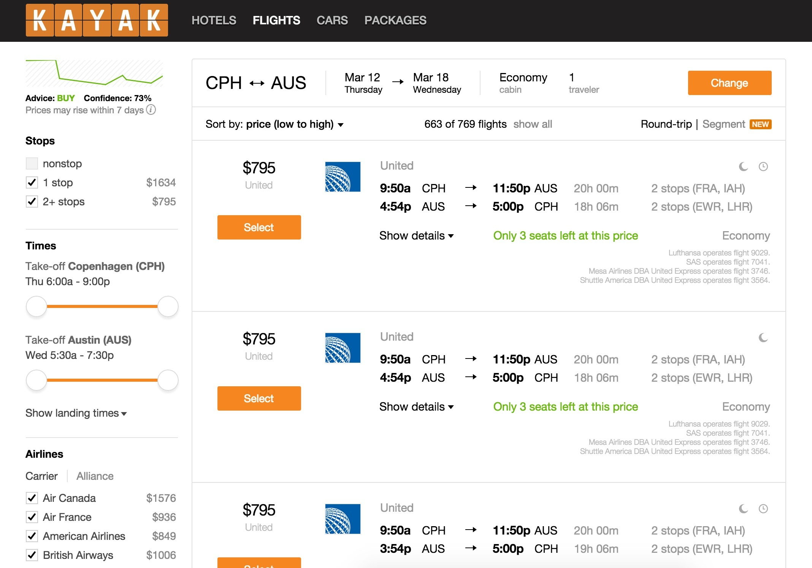

### Eis 4/29 \| Het platform moet inhoud bevatten die op de hoogte is van de laatste trends en ontwikkelingen 

Om op de hoogte te blijven van de laatste trends en ontwikkelingen, kan ik gebruik maken van morphing controls en een trigger. Morphing controls in de vorm van een knop en trigger in de vorm van een email die je dan krijgt. De trigger kan ook worden ingezet na het evenement, aangezien er dan wordt uitgelegd in een mail hoe het werkt met de content van de website. 

### Eis 5/29 \| Het platform moet de ervaringen van bezoekers laten zien

**Testimonials**  
Dit is een design pattern die wordt gebruikt wanneer de kwaliteit en betrouwbaarheid wordt laten zien van het product of dienst. Ik kan de pattern dus toepassen om de toekomstige Healthy Fest bezoekers te laten zien hoe bezoekers er over denken.

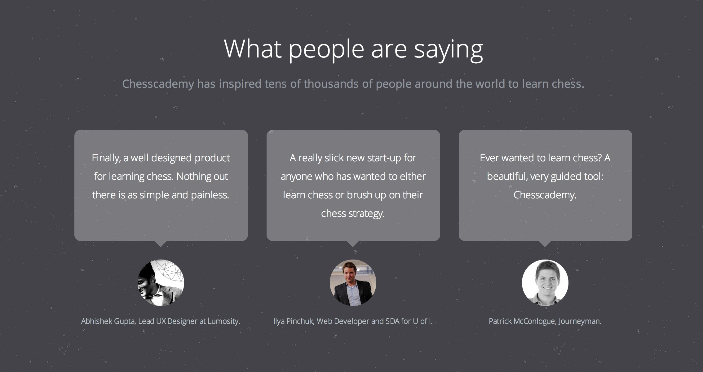

### Eis 6 \| **De gebruiker moet artikelen kunnen lezen en de mogelijkheid hebben om ze op te slaan en te delen**

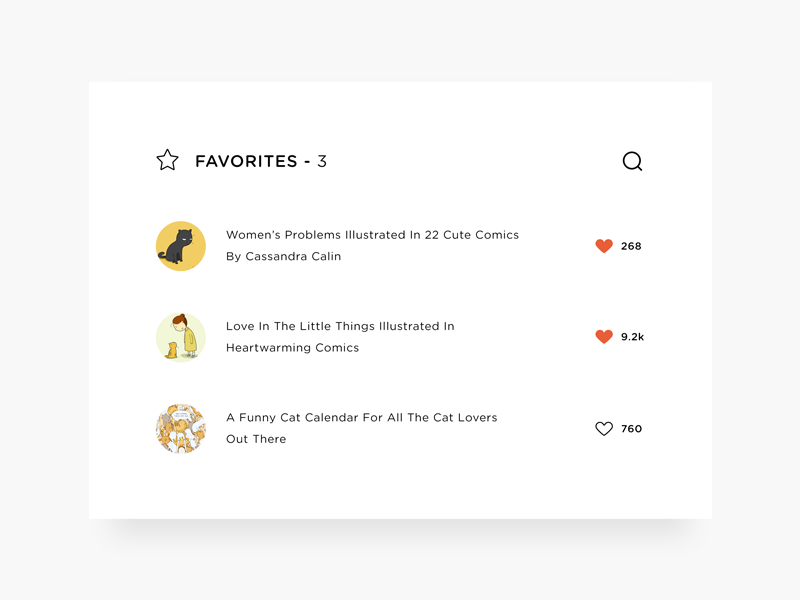

### Eis 7/29 \| Het platform moet een zoekfunctie bevatten

**Search**

 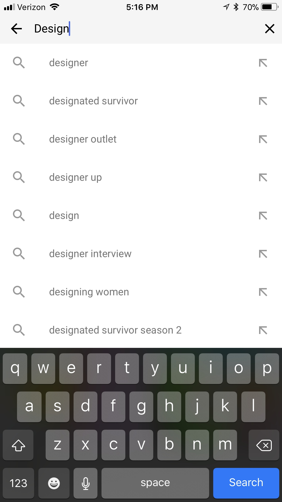

### Eis 8/29 \| Het platform moet haar content kunnen sorteren op video en tekst

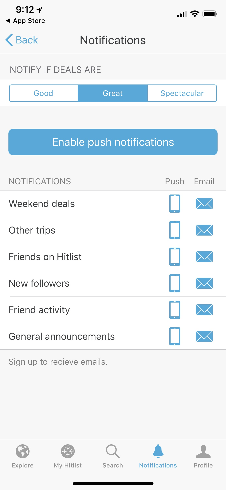 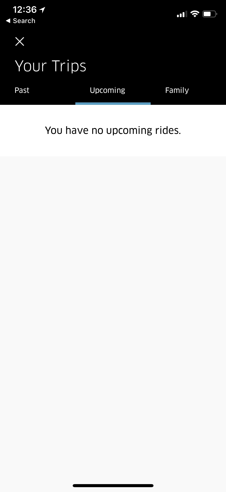 

### Eis 9/29 \| Het platform moet een countdown timer bevatten

###  Eis 10/29 \| Het platform moet een webshop bevatten

###  Eis 11/29 \| Op het platform moet je kunnen inloggen om te profiteren van extra's

### Eis 12/29 \| Het platform moet een social media login bevatten

###   Eis 13/29 \| Het platform moet social media buttons bevatten

### Eis 14/29 \| Het platform moet een forum bevatten

**Forum**  
Een forum wordt gebruikt als gebruikers een bepaald onderwerp willen bespreken of dat ze willen reageren op een stukje inhoud. Bij Healthy Fest is dit handig, aangezien ze behoefte hebben om met elkaar te praten over bijvoorbeeld samen naar Healthy Fest te gaan.

**Reaction**  
Deze design pattern kun je gebruiken om emoties op een eenvoudige manier te uiten. Deze pattern wordt vaak gebruik door de gebruiker op een gemakkelijke en informele manier te laten weten hoe hij of zij er over denkt. 

**Archive**  
Deze design pattern wordt gebruikt als een verzameling moet worden gebruikt in een chronologische volgorde. Dit kan bijvoorbeeld handig zijn op een forum, aangezien er hier veel onderwerpen en berichten kunnen ontstaan. Zo kunnen oude discussies ook worden teruggezocht. 

**Tabs**  
Deze design pattern wordt gebruikt wanneer de gebruiker een eenvoudige indeling zoekt van de content. Er worden tabbladen gebruikt om het gemakkelijk te maken en om snel te schakelen tussen de verschillende onderwerpen. Wanneer er meer opties zijn, die niet op het scherm passen, denk dan aan scrolbare tabbladen. De tabs kunnen gebruikt worden in het forum op Healthy Talk. 

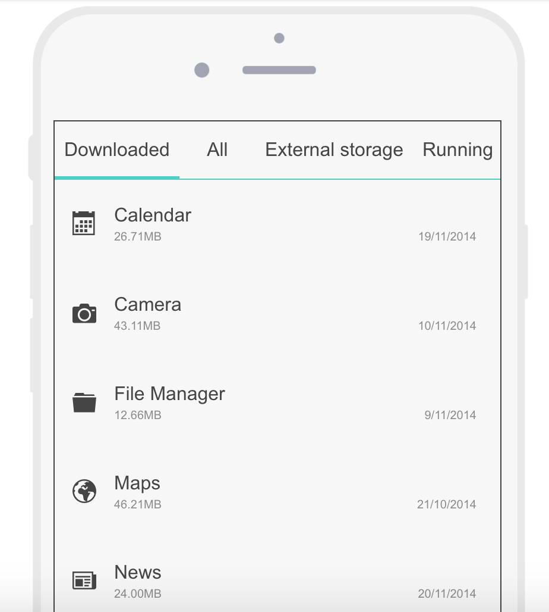 

### Eis 15/29 \| Het platform moet zo gebouwd worden zodat deze goed ontvangen kan worden door de gebruiker

### Eis 16/29 \| Het platform moet kunnen tonen welke doelgroep het evenement bezoekt

### Eis 17/29 \| Het platform moet een algemene pagina hebben over het evenement met de laatste informatie

### Eis 18/29 \| Het platform moet de eigen content van Healthy Fest bevatten

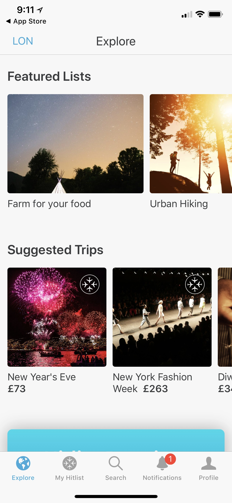 

### Eis 19/29 \| Tijdens het registreren moet je zien wat je te wachten staat tijdens je lidmaatschap

* [Completeness meter](http://ui-patterns.com/patterns/CompletenessMeter)

### Eis 20/29 \| Op het platform moet je ten alle tijden kunnen switchen tussen de evenementen

**Shortcut Dropdown**  
De shortcut dropdown wordt gebruikt wanneer de gebruiker op een snelle manier toegang moet krijgen tot een specifieke sectie of functionaliteit van een website, ongeacht de hiërarchie. De shortcut dropdown kan ik dus gebruiken in mijn website om ten alle tijde van het ene naar het andere event te gaan

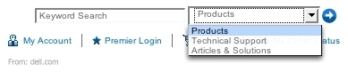



