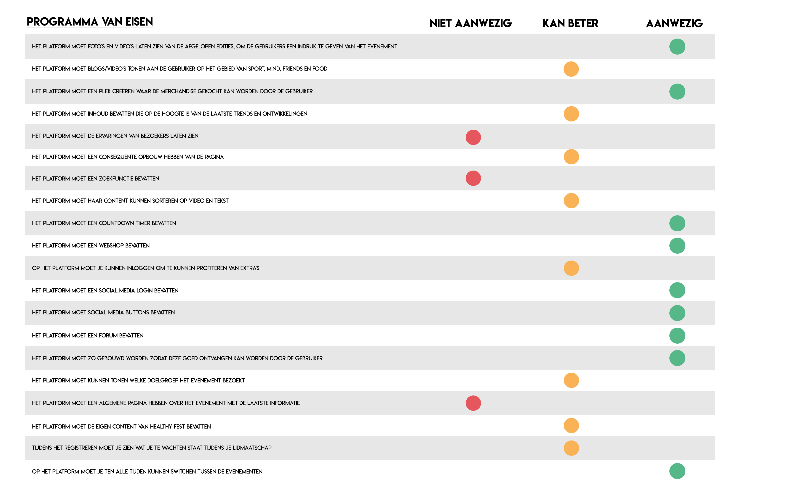

# Proof of concept

Om mijn concept te valideren, heb ik gebruik gemaakt van de Harris Profile methode. Hierbij kan ik zien in hoeverre mijn concept aansluit op mijn programma van eisen. Het programma van eisen is opgesteld vanuit de wensen en behoeftes van de stakeholders. Daardoor kan ik zien in in hoeverre het zin heeft om door te gaan op mijn concept, of dat ik mijn concept moet gaan aanpassen. 

Daarnaast heb ik, om mijn concept te valideren, een expert review gehouden. Ik wilde eerst ook een peer review houden met een oud CMD student, maar dit ga ik toch in een later stadium doen, aangezien ik nu alleen het concept wil testen. De expert review is is vooral bedoeld voor het concept . De test is gebaseerd op het concept welke te vinden is onder 'Concept'. 

### **Expert review**

Maarten Mulder   
**-** _Werkt op Healthy Fest Weekend  
- Komt ook als bezoeker op Healthy Fest Weekend_

Doel: ik wil weten of het concept aanslaat bij de Healthy Fest bezoeker en of de bezoeker de website ook daadwerkelijk gaat gebruiken  
  
**Je komt op de eerste pagina terecht, de homepagina. Wat zie je hier in chronologische volgorde en wat zou je nog meer willen zien?**  
Ik zie hier events staan. Verder zie ik een rondje met een poppetje, wat vast voor de inlogpagina staat en openklik menu. Verder zie ik wat getallen die te maken heeft met hoelang iets nog gaat duren denk ik? Ook kan ik meer lezen over 'Healthy Online' en de 'Afgelopen edities.' Ik durf niet echt te zeggen wat ik nog meer zou willen zien, omdat ik het niet goed voor me kan zien. Ja, ik wil beeldmateriaal zien!  
  
**Je zit nog steeds op de homepagina, wat is het eerste wat je op deze pagina zou doen?**  
Ik zou naar de afgelopen edities gaan, kicken! Ik verwacht hier te zien/lezen hoe de afgelopen edities van Healthy Fest verlopen zijn. Verder ben ik benieuwd wat er achter het openklik menu zit! Dus daar zou ik als tweede heen gaan.   
  
**Je opent het menu, waar zou je als eerst naar toe willen gaan?**  
Nou, ik zei natuurlijk eerst dat ik naar de afgelopen edities zou gaan. Maar dat was op de homepagina. Nu zou ik als eerst naar Healthy Talk gaan. Ben benieuwd wat daarachter zit!  
  
**Navigeer naar de registratie pagina, zou jij een account aanmaken?**  
Ik vind dat altijd lastig. Ik heb al zo veel accounts die ik moet onderhouden. Wat kan je daar allemaal dan? \(_Ik verwijs hem door naar het registreren\)_ Ooo oké ik ga wel even verder kijken. Ik vind wil jij er snel bij zijn niet zo lekker klinken eerlijk gezegd, hoe profiteer ik er dan van? Kortingen ga ik zeker goed op! Met anderen kletsen op een forum hoeft voor mij niet, heb er in ieder geval nooit behoefte aan gehad. Daarom zou ik eerlijk gezegd geen account aanmaken.  
  
**Wanneer je helemaal bent ingelogd kom je op je persoonlijke pagina, wat zie je hier en wat zou je nog meer willen zien?**  
Ik zie hier mijn boekingen, mijn opgeslagen artikelen & video's, mijn favoriete foto's en mijn bestelling. Mag ik nog een suggestie doen? Wellicht leuk om van mijn boekingen mijn boeking\(en\) te maken. De meeste mensen zullen maar 1 boeking tegelijk hebben en je bent echt een die hard wanneer je er meer boekt. Ik vind dat humor! Verder weet ik niet zo goed wat je hier moet toevoegen, misschien je eigen gegevens? Dus hoe oud ben je, hoe vaak ga je naar Healthy Fest en misschien een leuk feitje etc. 

**Je ziet linksboven op de homepagina het knopje events, wat verwacht je hieronder te zien?**  
De events van Healthy Fest. Ik neem aan dat je daar meer informatie krijgt over de desbetreffende events. Wat mij wel interessant lijkt, aangezien ik denk dat mensen vaak gericht zijn op een van de events van Healthy Fest en misschien wel interesse hebben in de andere events.

  
**Zou jij gebruik maken van het Healthy Fest forum?**  
Nou, dat vind ik lastig te zeggen. Ik ben niet zo forum ganger, al vind ik het wel leuk om met anderen te praten over sport en gezondheid. Ik ben misschien meer een kijker dan een prater, maar zou er zeker wel een kijkje willen nemen.    
****  
**Zou jij gebruik maken van de webshop?**  
Ja tuurlijk! Ik loop bijna altijd in sportkleren, dus dat kan ik altijd gebruiken. Krijg ik dan ook korting omdat ik naar Healthy Fest ben geweest? Dat zou natuurlijk al helemaal top zijn!  
  
**Zou jij de website op je telefoon of op je laptop bekijken?**  
Ik ben vaak onderweg, dus zou de website op mijn telefoon bekijken. Dit heb ik het afgelopen jaar ook gedaan!  
  
**Hoe vaak zou jij, op basis van dit concept, terugkomen op de Healthy Fest website?**  
Nou, ik ben erg benieuwd naar hoe het er uiteindelijk uit komt te zien. Dus sowieso 1 keer! Maar, ik zou hier denk ik best wel eens op kijken. Ik ben niet meer zo'n fan van Facebook, dus ik zou de website bezoeken voor het laatste nieuws. Al vind ik dat Healthy Fest het ook altijd goed doet met informatie in de mail.  
  
Conclusie:  
- Iemand die niks over UX UI weet, vind het lastig om vragen te krijgen die gaan over de flow en kan niet snel een onderwerp koppelen aan een wireframe  
- Gebruiker wil op de eerste pagina een indruk krijgen van Healthy Fest  
- Een andere tekst verzinnen op de registreer pagina voor: wil jij er snel bij zijn?  
- Gebruiker is niet meteen overtuigd om in te loggen, wellicht nog meer verleidingen erin gooien die overhalen om te registreren?  
- Goed om altijd de event pagina's te kunnen bezoeken voor de bezoeker. Aangezien de gebruiker hier denkt dat veel mensen vaak gericht zijn op 1 event en de rest misschien niet eens kennen  
- Wellicht kijken om 'mijn boekingen' bij de profielpagina te wijzigen in 'mijn boeking\(en\)'  
- Wellicht kortingen aanbieden op artikelen in de webshop aan Healthy Fest bezoekers  

### 

