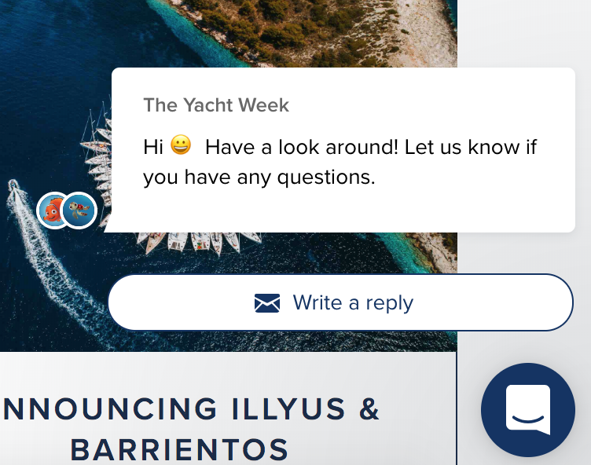

# Trend analyse

### **Onderzoek chatbot**

  
****_Frankwatching_  
****[Uit het onderzoek wat Nick Blom heeft gedaan op Frankwatching](https://www.frankwatching.com/archive/2018/03/20/starten-met-chat-op-je-website-5-essentiele-tips/) blijkt dat bij het inzetten van een chat het essentieel is dat je op tijd reageert. Als bezoekers niet binnen 30 seconden een reactie krijgen, is het geduld op en gaan ze weg.   
  
_One4Marketing_  
[In een artikel op One4Marketing](https://www.one4marketing.nl/blog/voordelen-nadelen-live-chat-website) staat dat de voordelen zijn dat het de mogelijkheid geeft de potentiële klant verder te helpen in zijn of haar aankoopproces. Ook geven ze aan dat het helpt om te zien welke vragen regelmatig worden gesteld, zodat je kunt zien op welk onderdeel de website moet verbeteren of uitbreiden. Verder kan de inzet van live chat leiden tot een toename van verkopen, met name op een e-commerce website of webshop. Volgens een case study van een Amerikaans bedrijf, [zijn hun verkopen enorm gestegen door het inzetten van live chat](http://www.jonathanvolk.com/internet-marketing/case-study-live-chat-increased-my-sales-300.html). Neem het artikel echter wel met een flinke korrel zout, uiteindelijk wordt er een specifieke chat applicatie gepromoot via een affiliate link.  
  
De nadelen die worden benoemt is dat het extra laadtijd oplevert. Bij het laden van de pagina's op je website, worden ook externe plugins geladen, waaronder de chatapplicatie. Omdat deze real-time communicatie verzorgt, zorgt dit vaak voor veel laadtijd. Een langere laadtijd is slecht voor de ervaring van klanten en daarmee ook slecht voor je resultaten in Google en andere zoekmachines.  
  
Na bovenstaande zaken te hebben overwegen, heb ik besloten geen live chat functie toe te voegen in de website. Uit eigen ervaring en uit het interview met Vicky van der Spoel weet ik dat er geen enkele collega tijd heeft om achter deze chatbox te gaan zitten, laat staan binnen een minuut te reageren. Wel ga ik nog onderzoeken wat de mogelijkheden zijn naar automatische live chats.   
  
****In [een artikel ](https://www.marketingfacts.nl/berichten/chatbot-checklist-moet-je-er-wel-aan-beginnen)op Marketingfacts uit 2018 staat dat het toevoegen van chatbots een intensief en kostbaar proces is. "Pas als een chatbot live staat, begint het echte werk. De dialogen moeten aan de ‘achterkant’ gereviewd worden. Bij alle verkeerde antwoorden van je chatbot moet je deze opnieuw trainen zodat toekomstige dialogen beter verlopen. Dit is een voortdurende klus die veel tijd kost. De werkdruk bij medewerkers vermindert misschien door de komst van een chatbot, maar tegelijk heb je wel \(andere\) mensen nodig die de content van de chatbot beheren, optimaliseren en uitbreiden."  
  
**Conclusie**  
Gezien het feit dat RTL Live Entertainment de Healthy Fest Fan wil creëren en ze aangaven dat de ticketverkoop goed gaat in combinatie met bovenstaande informatie, heb ik besloten om ook geen chatbot toe te voegen aan het platform. Het is nu \(nog\) niet het moment om veel tijd, geld en energie in een chatbot te steken én dus ook niet in een live chatfunctie.

### **Forum**

Om te kijken of een forum wel een goede toevoeging is op het platform, ben ik onderzoek gaan doen op internet. 

[In een artikel op Vrijdag Online](https://vrijdagonline.nl/weblog/hoe-zorg-ik-voor-meer-interactie-op-mijn-website) staat dat uit wetenschappelijk onderzoek van Lotte Willemsen is gebleken dat proactieve communicatie op het eigen platform veel meer gewaardeerd wordt dan communicatie op consumentenplatformen. Volgens het onderzoek heeft het toegankelijker maken van je website een positiever effect op klanttevredenheid dan het helpen van klanten op consumentenplatforms of op social media.

Er worden in het artikel ook een aantal voorbeelden genoemd:  
  
- Er wordt gezegd dat klanten vragen op de website kunnen stellen en hierbij een snel antwoord kunnen krijgen  
- Ook wordt er genoemd dat men hier vrij zelfvoorzienend is, aangezien mede bezoekers antwoord geven op elkaar  
- Als derde voordeel wordt er genoemd dat de dialogen op een eigen site makkelijker bij te houden zijn en te meten. In tegenstelling tot social media sites of andere externe sites ben jij hier de beheerder. Jij bent de eigenaar van de data. Hierdoor kun je nog meer te weten komen over je klanten, waardoor je hen in de toekomst nog maar beter kunt helpen. 

[In een artikel op Evoworks](https://www.evoworks.nl/wiki/forum) staat dat gebruikers die teksten publiceren of reageren op teksten op een forum dit meestal doen onder een bijnaam of nickname. Gebruikers gebruiken een bijnaam of nickname omdat je jezelf vaak moet registreren om deel te nemen aan het forum om berichten te kunnen plaatsen. Het is dus handig om de mogelijkheid te geven om alleen te reageren onder een 'nepnaam'. In het forum op Healthy Fest moet wel duidelijk worden welke voordelen er voor Healthy Fest zijn, wanneer je je wel registreert. 

In het artikel staat ook dat een nadeel kan zijn dat iedereen er zijn of haar reacties kan geven. Op forums wordt niet altijd de meest betrouwbare of zinvolle informatie gegeven. Omdat berichten op een forum niet persoonlijk zijn, doordat je een bijnaam of nickname hebt, publiceren sommige gebruikers nog al haatdragende teksten op een forum. De eigenaar van een forum kan deze gebruikers verwijderen of blokkeren van zijn forum wanneer dit te vaak voorkomt. Ik verwacht niet dat dit bij Healthy Fest gaat gebeuren, aangezien het doel sporten is en dit niet snel moeilijkheden/discussies zal opleveren. 

Conclusie:  
- Wel een forum toevoegen aan het platform  
- Mogelijkheid tot het plaatsen van reactie onder een gebruikersnaam, zonder registratie

