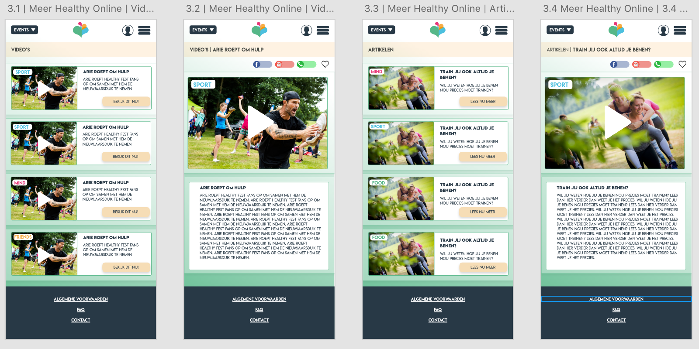

# Wijzigingen

### 1.0 Homepagina

> Op de homepagina is er een tekst toegevoegd, waardoor je weet waar de countdown timer naar toe telt. Verder is er een button toegevoegd, die de ticketverkoop stimuleert. Ook is er in het uitklapmenu een zoekfunctie toegevoegd. Je kunt het uitklapmenu nu ook wegklikken. Verder is er een pagina toegevoegd, waarbij je bij de events kunt kiezen uit de evenementen die Healthy Fest op dit moment bezit.

> 

**Wijzigingen**  
De grootste wijzigingen op de homepagina in prototype 0.9 is het design geworden. Uit de footer zijn de social media buttons weggehaald, deze staan nu alleen nog maar in het uitschuif menu. De social media buttons zijn Facebook, Instagram en Youtube geworden. 

###  2.0 \| Inloggen

> Op de inlogpagina is er een stap weggehaald. In het vorige ontwerp kreeg je pas de mogelijkheden te zien, wanneer je in de registreer pagina zit. De beloftes komen nu al op de eerste pagina, zodat gebruikers zich sneller aanmelden. Ook is de balk weggehaald waarbij de titel van de pagina te zien is. Op de profielpagina zelf kun je nu vanuit het scherm ook boekingen, artikelen en video's, foto's en merchandise toevoegen. De reacties die de gebruikers geven op het forum, zijn nu ook toegevoegd op de pagina.

> 

**Wijzigingen**  
Op de homepagina van het profiel is er nu alleen nog maar een Facebook knop qua social media login. Ook de tekst voor het inloggen verandert. Op de profielpagina zelf is er een tekst toegevoegd bij het plusteken, zodat het duidelijk is waarvoor hij dient. Ook de tekst is gewijzigd van de titels. Je kunt foto's doorkijken door te klikken op het pijltje, zo kun je oneindig veel foto's toevoegen en dus bekijken. 

### 3.0 \| Afgelopen edities

> Bij de afgelopen edities is er op de video's en foto's pagina een functie toegevoegd, waarbij je kan kiezen uit welk jaar de content moet komen. Ook is er een pagina toegevoegd, die laat zien dat je alleen foto's en video's tot je favoriet kan maken wanneer je ingelogd bent. Gebruikers kunnen de opgeslagen favorieten later terugkijken op de profielpagina. Bij het bekijken van de aftermovie kun je nu ook de aftermovie sluiten.

> 

**Wijzigingen**  
Bij de eerste pagina is de titel van de pagina gewijzigd, nu staat er alleen nog maar foto's en video's. Ook kun je scrollen door de foto's, door te klikken op de grote pijlen. De grootste wijziging is hier ook het design. 

### 4.0 \| Meer Healthy Online

> Bij Healthy Online is er meer ruimte gemaakt op de overzicht pagina's van video's en artikelen. Er is ruimte gemaakt voor tekst, zodat de gebruiker een indruk krijgt wat er verder te zien of te lezen is. Ook is er een andere indeling gemaakt op de detail pagina, zodat het consistenter wordt.

> 

**Wijzigingen**  
Bij Healthy Online is de grootste wijziging dat er de video's en artikelen nu worden onderverdeeld in sport, mind, food en friends. Je kunt dus precies zien onder welke categorie de video of artikel valt. Ook is er tekst toegevoegd, zodat de gebruiker wordt overgehaald om dit te gaan lezen of bekijken. Ook is de indeling wat aangepast, zodat het consistenter wordt.    

### 5.0 \| Healthy Talk

> Op de eerste forum pagina zijn de onderwerpen kleiner gemaakt, zodat de gebruiker in één opzicht kan zien wat de onderwerpen zijn. Ook kun je nu alleen maar verder in het forum, wanneer je bent ingelogd. Bij de indeling waar je kunt zien, zijn nu alleen de eigen reacties te zien. Daarna zijn de pagina's helemaal verandert, aangezien er geen logica meer in zat. Je kunt nu switchen tussen de onderwerpen en je kunt zien hoeveel reacties er zijn geplaatst en wanneer. Ook kun je een like geven op de geplaatste berichten zie je de reacties van anderen op een logische manier. Verder is de foto van de gebruiker toegevoegd.

> 
>
> 

**Wijzigingen**  
Bij de schermen van Healthy Talk zijn er alleen op visueel gebied aanpassingen gemaakt.

### 6.0 \| Shop

> Er is een zoekfunctie toegevoegd bij de webshop, zodat je kunt zoeken op artikelen. Ook kun je nu meteen zien hoeveel een artikel kost. Op de detailpagina van het artikel, worden foto's getoond van de artikelen. Op de pagina van de winkelwagen zie je nu hoe het artikel heet, hoeveel het kost en hoeveel de kosten in totaal gaan zijn. 
>
> 

**Wijzigingen**  
Bij de webshop zijn er nieuwe titels gekomen qua sorteren. Ook kun je op de detailpagina van het artikel nu het aantal van het artikel toevoegen, het artikel opslaan als favoriet \(en later terugkijken in de profielpagina\) en het toevoegen in de winkelwagen. 

### 7.0 \| Contact

> Bij de contactpagina is er een tekst toegevoegd waar je de contactinformatie kunt lezen en een formulier die je kunt invullen die meteen naar Healthy Fest gaat.

> 

**Wijzigingen**  
  
Op de pagina over Healthy Fest zie je nu een tekst die van de huidige website van Healthy Fest komt. Ook is er een design over de social buttons gegooid. Verder is er een verzend knop toegevoegd aan de contact pagina. 

###  8.0 \| Events

> Op dit moment zijn er nog geen wijzigingen op de eventpagina, omdat de testpersonen nog niet veel konden zien qua inhoud. 
>
> 

**Wijzigingen**

Op de event pagina is er toegevoegd wat je op de algemene pagina te zien krijgt van het Healthy Fest Weekend. Op de programma pagina van Healthy Fest is er te zien wat er allemaal te doen is tijdens het weekend. De teksten komen van de website van Healthy Fest zelf. 

