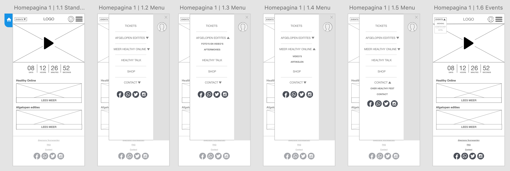
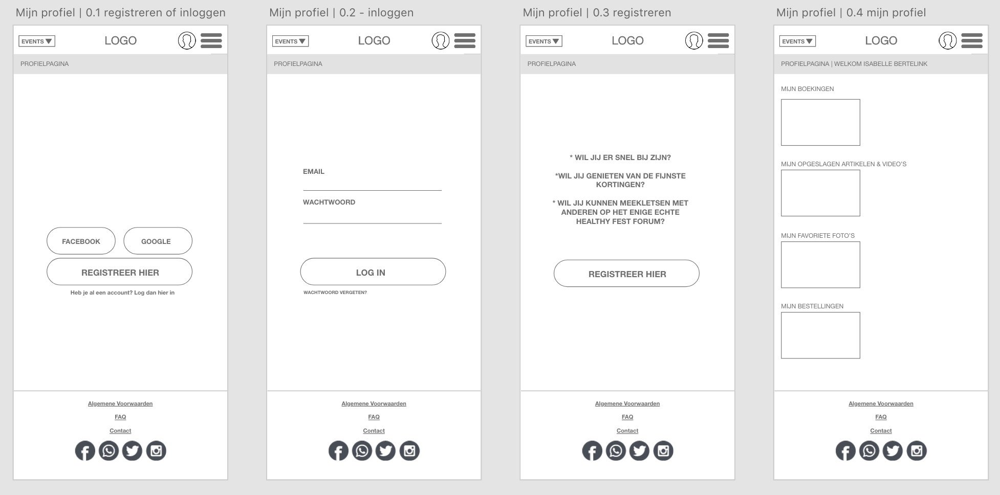
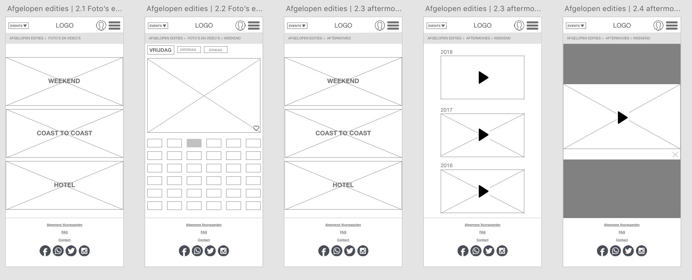
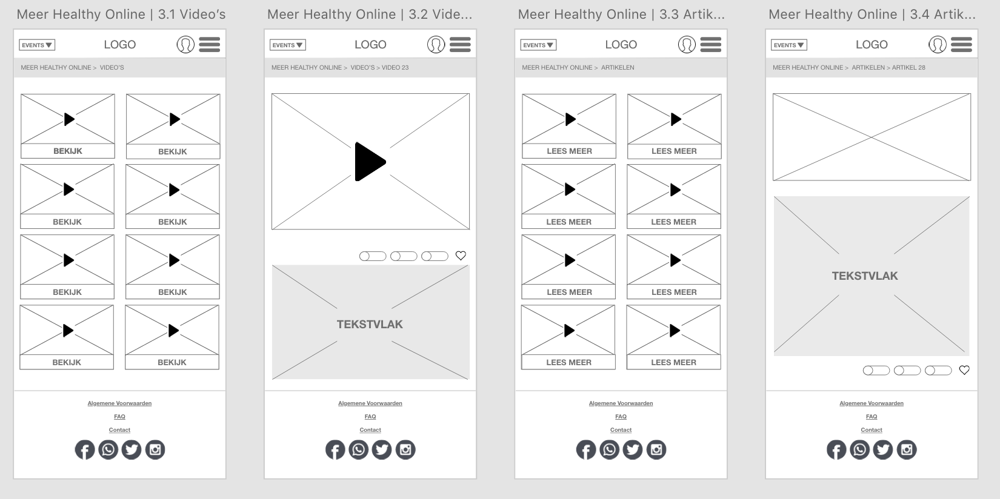
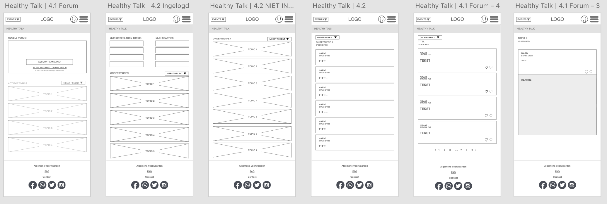
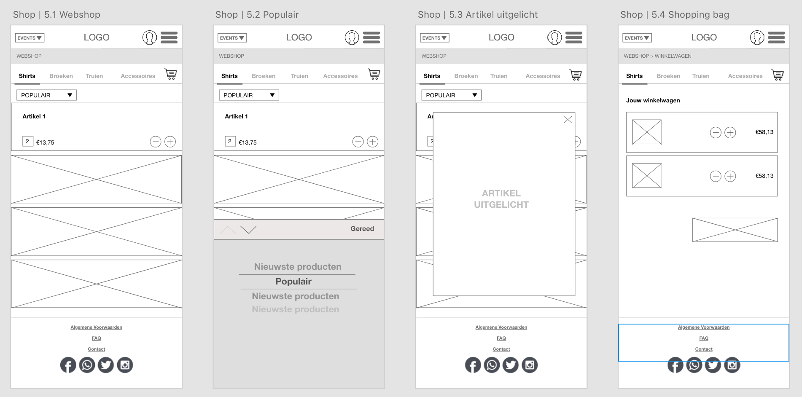
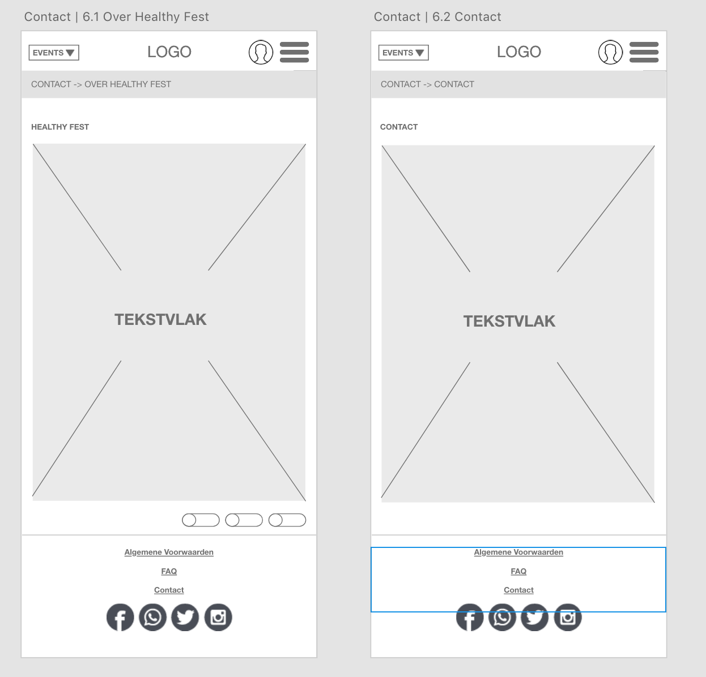
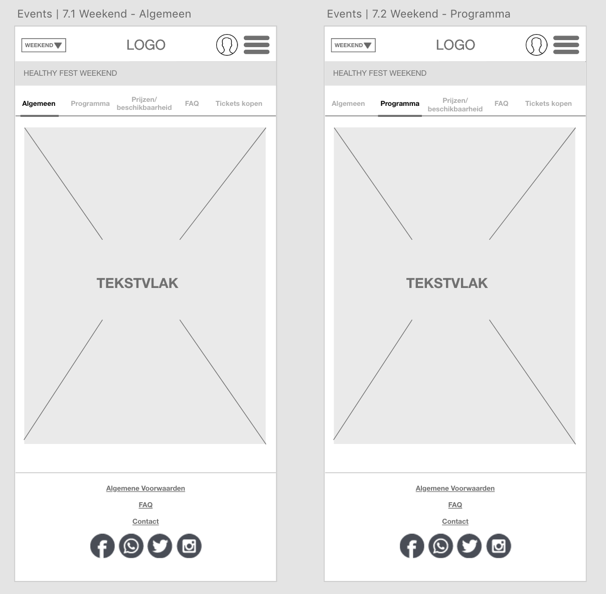

# Ontwerp



### 1.0 \| Homepagina

Op de homepagina krijg je een video te zien, die kort een indruk geeft van alle evenementen die Healthy Fest op dit moment heeft \(Healthy Fest Weekend, Healthy Fest Coast to Coast en Healthy Fest Hotel\). Daaronder is een aftelklok te zien. Verder wordt er aangespoord om een bezoek te brengen aan Healthy Online en Afgelopen edities. Ook kun je naar de eventpagina's te gaan, door op event's te klikken. Je kunt inloggen en de menubalk openklappen, waar verschillende opties te vinden zijn die hieronder worden uitgelegd. 

###  2.0 \| Inloggen

Op de inlogpagina komt de gebruiker door op het login poppetje te klikken boven in de menubalk of in het uitklap menu. De gebruiker kan inloggen, maar dit hoeft niet. De gebruiker krijgt op verschillende pagina's steeds vaker te zien dat er meer functies komen wanneer hij of zij inlogt. In het account kan de gebruiker alles opslaan, zodat de gebruiker hier later met een glimlach nogmaals naar kan kijken. 

###  3.0 \| Afgelopen edities

Bij de afgelopen edities ziet de gebruiker de content van de afgelopen evenementen van Healthy Fest. Hierbij kan de bezoeker kiezen uit foto's en video's en de aftermovie. Ook wordt er onderscheid gemaakt tussen de verschillende evenementen. Bij de foto's en video's ziet de gebruiker korte fragmenten en foto's en bij de de aftermovie ziet met de aftermovies van de afgelopen evenementen. Ook kan de gebruiker  foto's en video's toevoegen, die de gebruiker later kan terugkijken in zijn of haar account. 

### 4.0 \| Meer Healthy Online

Bij meer Healthy Online ziet men de video's en artikelen die Healthy Fest zelf al bezit. Hierbij kan de gebruiker vooraf kiezen of hij of zij video's wil zien of artikelen. De gebruiker kan deze video's en artikelen ook delen met social media of toevoegen als favoriet \(en later terugkijken in zijn of haar account\). 

###  5.0 \| Healthy Talk

In Healthy Talk wordt het Healthy Fest forum ondergebracht. De gebruiker kan verder zonder account, maar kan dan niet reageren op posts. Wanneer de gebruik inlogt, kan hij of zij eigen reacties bekijken en topics opslaan. 

###  6.0 \| Shop

Bij de Online Healthy Fest shop wordt de merchandise verkocht die op de evenementen zelf te koop is. Je kunt artikelen hierbij sorteren op shirts, broeken, truien en accessoires. Ook kun je de artikelen sorteren. 

###   7.0 \| Contact

Bij de contactpagina wordt er onderscheid gemaakt tussen 'over Healthy Fest' en 'contact'. 

###  8.0 \| Events

Bij de event pagina kan de gebruiker een indruk krijgen van de evenementen. Hierbij wordt onderscheid gemaakt tussen algemene informatie, het programma, de prijzen/beschikbaarheid, veelgestelde vragen en het kopen van tickets. 

**Belangrijk:**  
De ticket pagina is niet uitgewerkt, aangezien je meteen naar een webshop wordt geleid. 

