# Wijzigingen

### 1.0 Homepagina

> Ontwerp Lo-Fi Prototype 0.1  
> Op de homepagina krijg je een video te zien, die kort een indruk geeft van alle evenementen die Healthy Fest op dit moment heeft \(Healthy Fest Weekend, Healthy Fest Coast to Coast en Healthy Fest Hotel\). Daaronder is een countdown timer te zien. Verder wordt er aangespoord om een bezoek te brengen aan Healthy Online en Afgelopen edities. Ook kun je naar de eventpagina's te gaan, door op event's te klikken. Je kunt inloggen en de menubalk openklappen, waar verschillende opties te vinden zijn die hieronder worden uitgelegd.

> 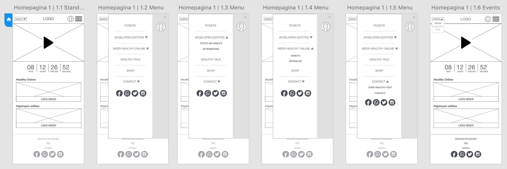

**Wijzigingen**  
Op de homepagina is er een tekst toegevoegd, waardoor je weet waar de countdown timer naar toe telt. Verder is er een button toegevoegd, die de ticketverkoop stimuleert. Ook is er in het uitklapmenu een zoekfunctie toegevoegd. Je kunt het uitklapmenu nu ook wegklikken. Verder is er een pagina toegevoegd, waarbij je bij de events kunt kiezen uit de evenementen die Healthy Fest op dit moment bezit. 

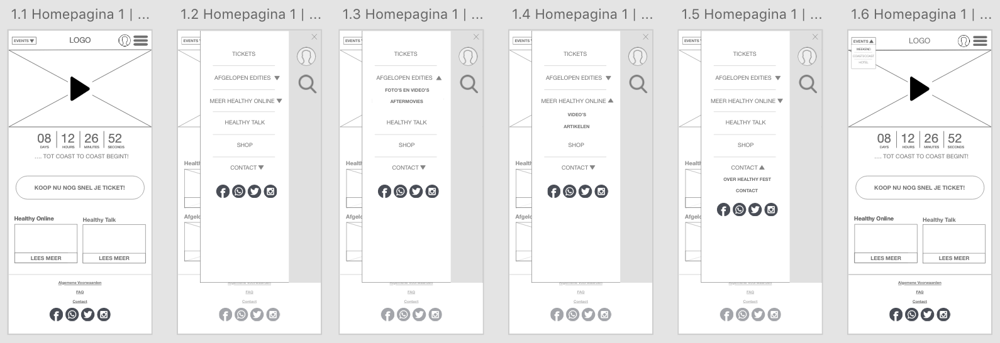

### 2.0 \| Inloggen

> Op de inlogpagina komt de gebruiker door op het login poppetje te klikken boven in de menubalk of in het uitklap menu. De gebruiker kan inloggen, maar dit hoeft niet. De gebruiker krijgt op verschillende pagina's steeds vaker te zien dat er meer functies komen wanneer hij of zij inlogt. In het account kan de gebruiker alles opslaan, zodat de gebruiker hier later met een glimlach nogmaals naar kan kijken.

> 

**Wijzigingen**  
Op de inlogpagina is er een stap weggehaald. In het vorige ontwerp kreeg je pas de mogelijkheden te zien, wanneer je in de registreer pagina zit. De beloftes komen nu al op de eerste pagina, zodat gebruikers zich sneller aanmelden. Ook is de balk weggehaald waarbij de titel van de pagina te zien is. Op de profielpagina zelf kun je nu vanuit het scherm ook boekingen, artikelen en video's, foto's en merchandise toevoegen. De reacties die de gebruikers geven op het forum, zijn nu ook toegevoegd op de pagina. 

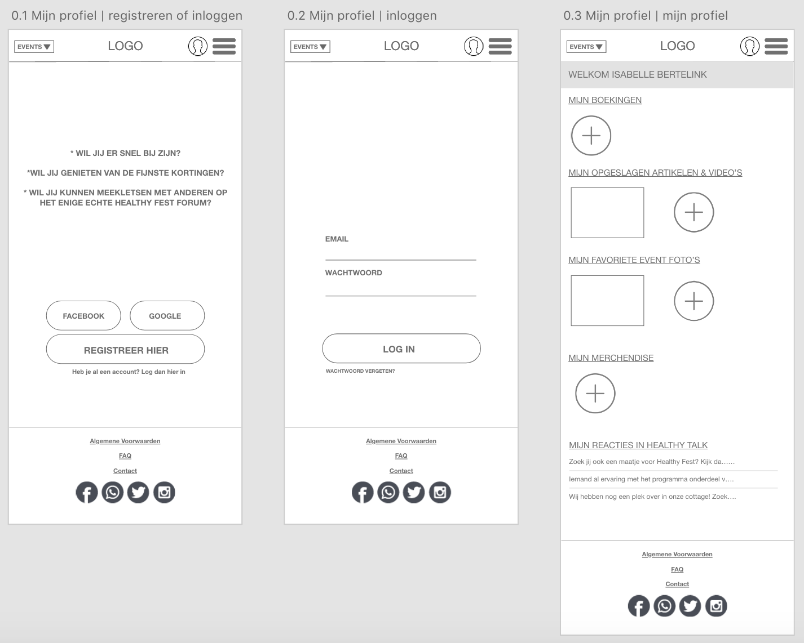

###  3.0 \| Afgelopen edities

> Bij de afgelopen edities ziet de gebruiker de content van de afgelopen evenementen van Healthy Fest. Hierbij kan de bezoeker kiezen uit foto's en video's en de aftermovie. Ook wordt er onderscheid gemaakt tussen de verschillende evenementen. Bij de foto's en video's ziet de gebruiker korte fragmenten en foto's en bij de de aftermovie ziet met de aftermovies van de afgelopen evenementen. Ook kan de gebruiker  foto's en video's toevoegen, die de gebruiker later kan terugkijken in zijn of haar account.

> 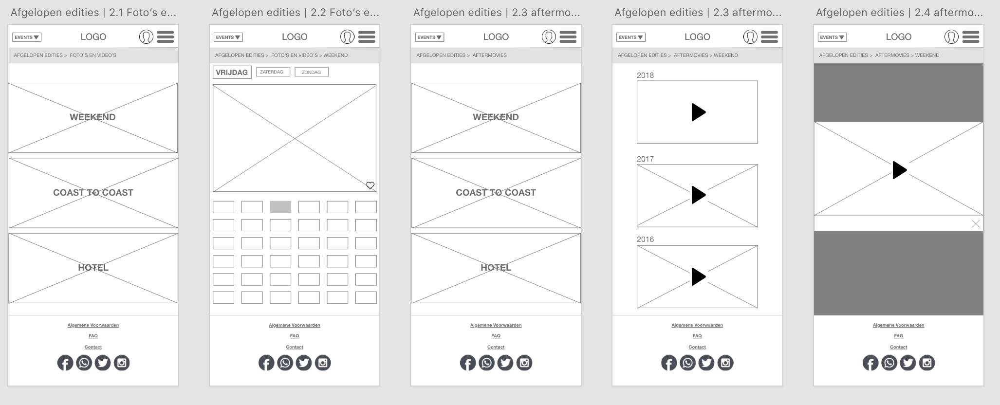

**Wijzigingen**  
Bij de afgelopen edities is er op de video's en foto's pagina een functie toegevoegd, waarbij je kan kiezen uit welk jaar de content moet komen. Ook is er een pagina toegevoegd, die laat zien dat je alleen foto's en video's tot je favoriet kan maken wanneer je ingelogd bent. Gebruikers kunnen de opgeslagen favorieten later terugkijken op de profielpagina. Bij het bekijken van de aftermovie kun je nu ook de aftermovie sluiten.  

### 4.0 \| Meer Healthy Online

> Bij meer Healthy Online ziet men de video's en artikelen die Healthy Fest zelf al bezit. Hierbij kan de gebruiker vooraf kiezen of hij of zij video's wil zien of artikelen. De gebruiker kan deze video's en artikelen ook delen met social media of toevoegen als favoriet \(en later terugkijken in zijn of haar account\).

> 

**Wijzigingen**  
Bij Healthy Online is er meer ruimte gemaakt op de overzicht pagina's van video's en artikelen. Er is ruimte gemaakt voor tekst, zodat de gebruiker een indruk krijgt wat er verder te zien of te lezen is. Ook is er een andere indeling gemaakt op de detail pagina, zodat het consistenter wordt.  

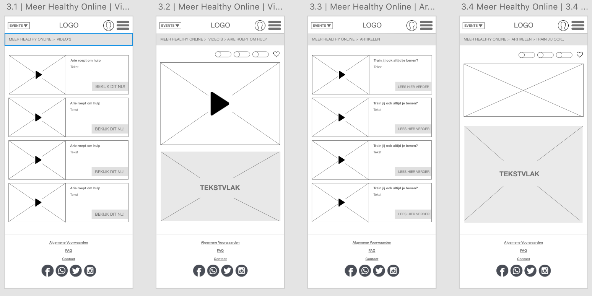

### 5.0 \| Healthy Talk

> In Healthy Talk wordt het Healthy Fest forum ondergebracht. De gebruiker kan verder zonder account, maar kan dan niet reageren op posts. Wanneer de gebruik inlogt, kan hij of zij eigen reacties bekijken en topics opslaan.

> 

**Wijzigingen**  
Op de eerste forum pagina zijn de onderwerpen kleiner gemaakt, zodat de gebruiker in één opzicht kan zien wat de onderwerpen zijn. Ook kun je nu alleen maar verder in het forum, wanneer je bent ingelogd. Bij de indeling waar je kunt zien, zijn nu alleen de eigen reacties te zien. Daarna zijn de pagina's helemaal verandert, aangezien er geen logica meer in zat. Je kunt nu switchen tussen de onderwerpen en je kunt zien hoeveel reacties er zijn geplaatst en wanneer. Ook kun je een like geven op de geplaatste berichten zie je de reacties van anderen op een logische manier. Verder is de foto van de gebruiker toegevoegd.

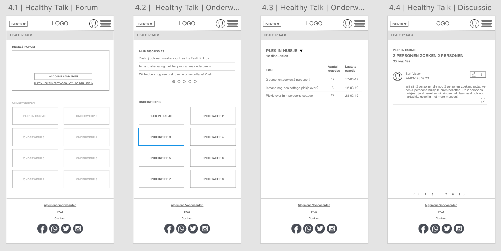

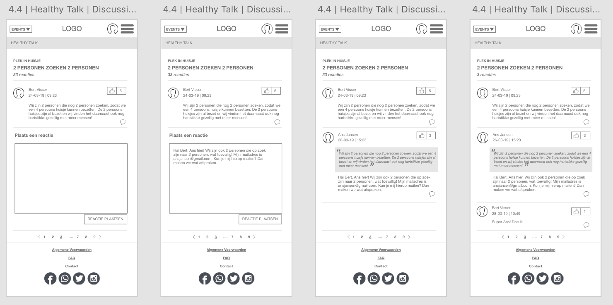

###  6.0 \| Shop

> Bij de Online Healthy Fest shop wordt de merchandise verkocht die op de evenementen zelf te koop is. Je kunt artikelen hierbij sorteren op shirts, broeken, truien en accessoires. Ook kun je de artikelen sorteren.

> 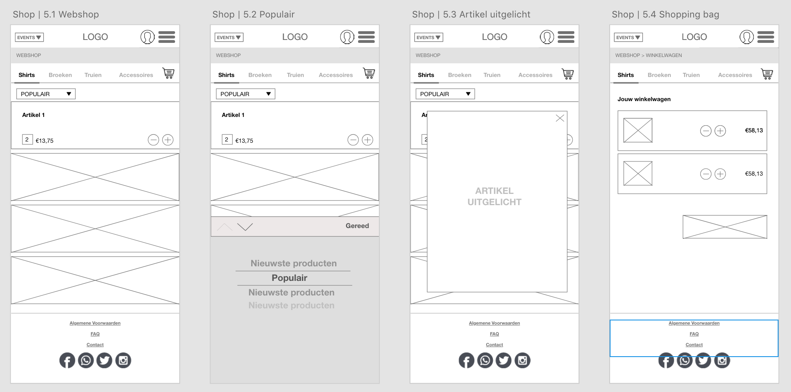

**Wijzigingen**  
Er is een zoekfunctie toegevoegd bij de webshop, zodat je kunt zoeken op artikelen. Ook kun je nu meteen zien hoeveel een artikel kost. Op de detailpagina van het artikel, worden foto's getoond van de artikelen. Op de pagina van de winkelwagen zie je nu hoe het artikel heet, hoeveel het kost en hoeveel de kosten in totaal gaan zijn. 

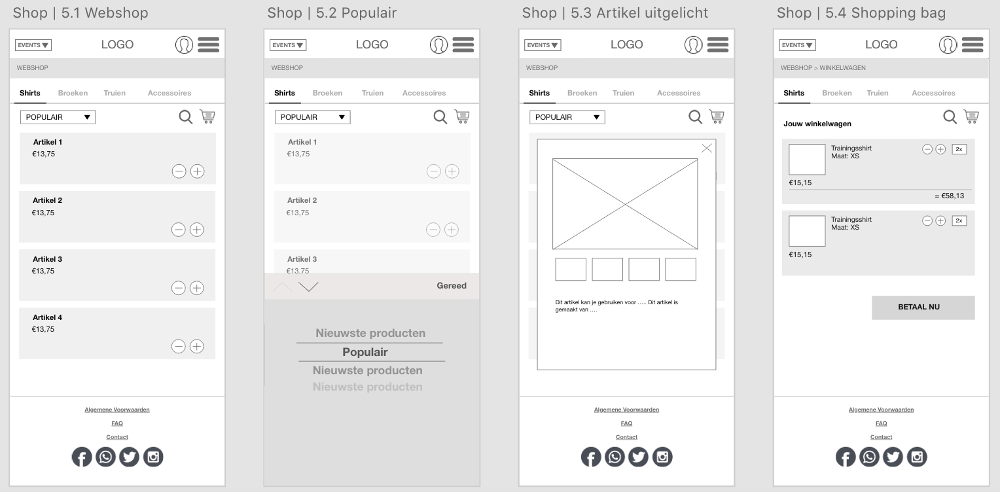

### 7.0 \| Contact

> Bij de contactpagina wordt er onderscheid gemaakt tussen 'over Healthy Fest' en 'contact'.

> 

**Wijzigingen**  
Bij de contactpagina is er een tekst toegevoegd waar je de contactinformatie kunt lezen en een formulier die je kunt invullen die meteen naar Healthy Fest gaat. 

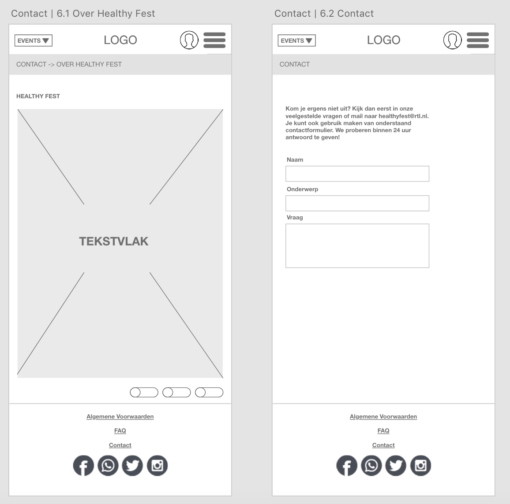

###  8.0 \| Events

> Bij de event pagina kan de gebruiker een indruk krijgen van de evenementen. Hierbij wordt onderscheid gemaakt tussen algemene informatie, het programma, de prijzen/beschikbaarheid, veelgestelde vragen en het kopen van tickets.

> 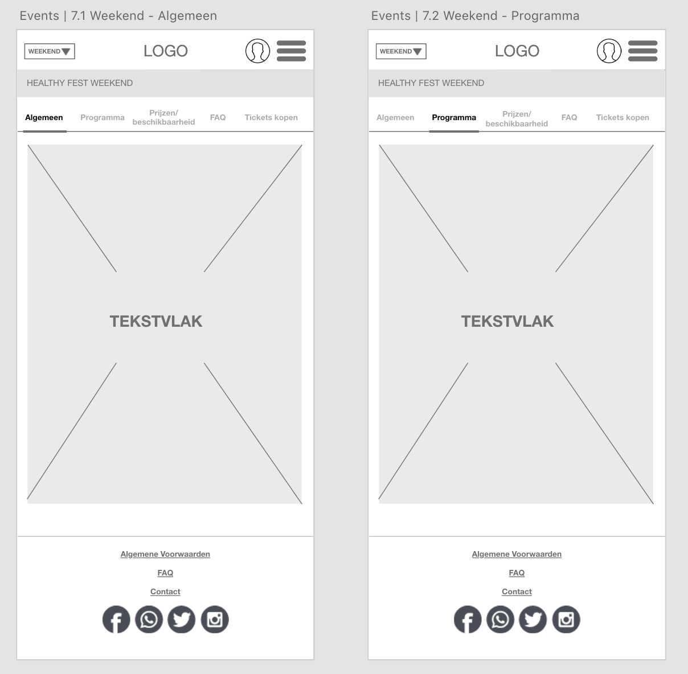

**Wijzigingen**  
Op dit moment zijn er nog geen wijzigingen op de event pagina, omdat de testpersonen nog niet veel konden zien qua inhoud.  

