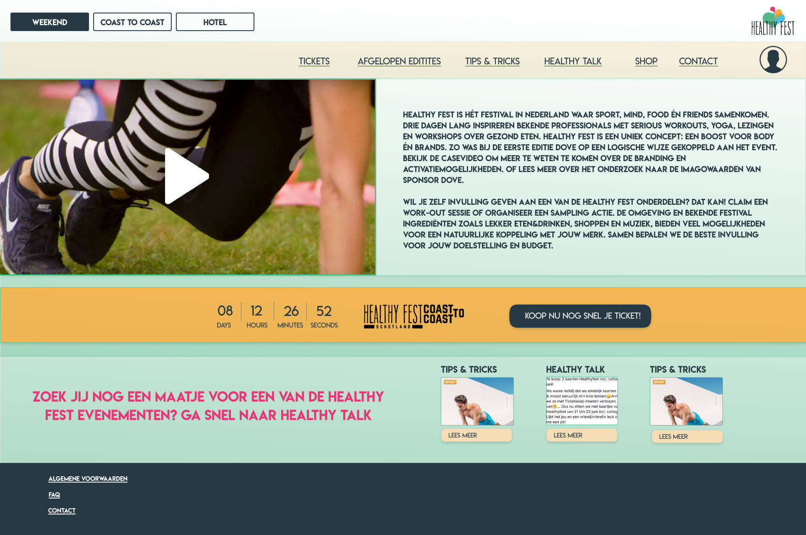

# Advies

Het advies wat ik RTL Live Entertainment over het platform van Healthy Fest zal geven is gebaseerd op een uitbreiding van het platform en het risico. Ik kijk er naar uit om samen met RTL Live Entertainment de website te bouwen en te blijven ontwikkelen. In afbeelding 9 is te zien hoe de website eruit zal komen te zien in web aanzicht.

  
**App**  
Wanneer de website aanslaat bij het publiek en er dus daadwerkelijk Healthy Fest Fans zijn gecreëerd, is het de moeite waard om te gaan onderzoeken of het in dat stadium nuttig is om een applicatie te ontwikkelen voor Healthy Fest. De app hoeft niet veel af te wijken van het huidige ontwerp voor de website gebaseerd op de mobiele weergave.  
  
**Risico**   
Er is tijdens het maken van het onderzoeken één doelgroep ontstaan. Maar, stel dat RTL Live Entertainment een evenement bedenkt, dat totaal los staat van doelgroep waar nu op gefocust is. Zal er dan teveel verschillende content op de website komen, waardoor je een van de doelgroepen gaat verliezen? Dit risico wil ik voor zijn en ga ik samen met RTL Live Entertainment bespreken.   
  
**Trainers/sprekers**   
Om de website verder te ontwikkelen, kan er gekeken worden naar de wensen en behoeftes van de trainers en sprekers die op de evenementen komen. Zij zijn een groot element waardoor Healthy Fest bestaat en waardoor er dus Healthy Fest Fans worden gecreëerd. Wellicht bezitten zij ideeën voor de website, om hun eigen inbreng voor Healthy Fest nog groter te maken.   
  
Het grootste advies wat ik RTL Live Entertainment ga geven, is dat ze de website zo snel mogelijk zullen moeten ontwikkelen tot mijn ontwerp. Ik heb ingespeeld op de doelgroep van nu. In de toekomst zullen de wensen en de behoeftes van de Healthy Fest bezoekers wellicht veranderen, maar hier kan later op ingespeeld worden. Dit is dus tevens een risico, dat ik voor wil zijn.

