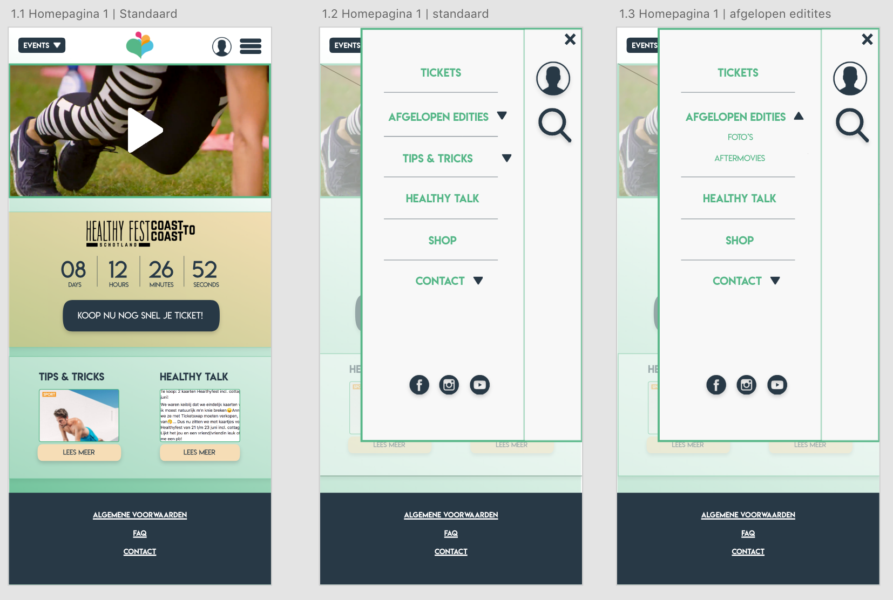
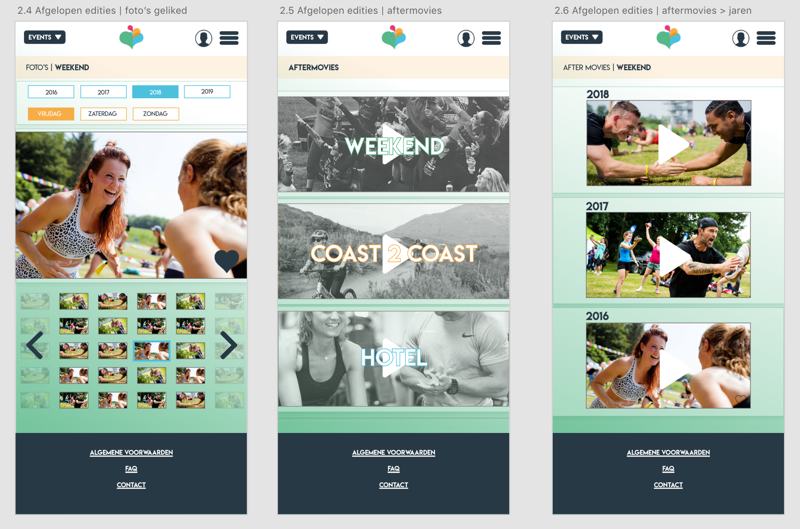
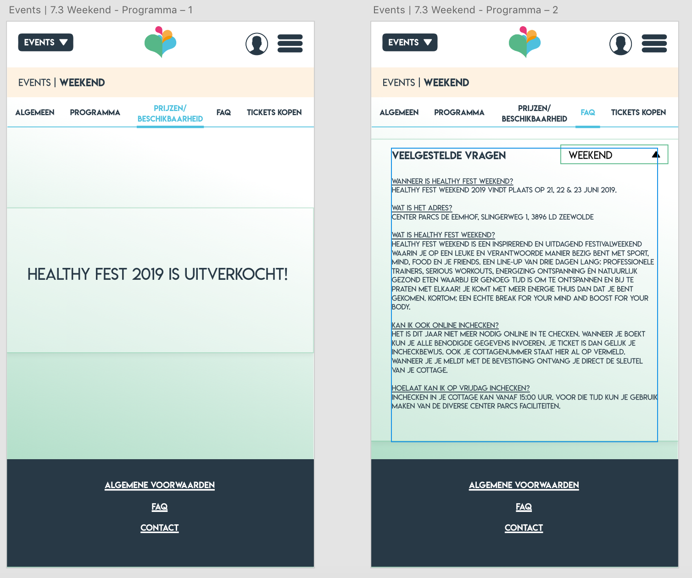

# Wijzigingen

### 1.0 Homepagina

* Countdown timer gewijzigd, meer opvallen -> gekeken naar inspiratie hoe anderen deden
* Healthy online gewijzigd in tips & tricks. Kwam in bijna elke test wel terug dat mensen het lastig vonden om te vinden waar artikelen etc stonden

###  2.0 \| Inloggen

* Toevoegen knoppen opvallender maken
* Direct kunnen doorkoppelen naar reacties in Healthy Talk

### 3.0 \| Afgelopen edities

* Er is een pop up gescherm gemaakt om het nut van het hartje uit te leggen. Gebruikers gaven aan dat ze niet wisten wat er meer zou gebeuren.
* Ook is het hartje gevuld op het moment dat de gebruiker op het hartje heeft gedrukt en de pop up heeft gekregen.

### 4.0 \| Meer Healthy Online -> Tips & Tricks 

* Naam dus gewijzigd, nu meer duidelijk dat je daar artikelen en video’s kan vinden over tips en tricks voor je gezondheid.

### 5.0 \| Healthy Talk

* 'Regels forum' verandert in 'Hoe werkt het?' Hierdoor hebben gebruikers meer verwachtingsmanagement. De gebruikers gaven  in de testen aan dat ze het lastig vonden wat ze hier konden verwachten.
* Button toegevoegd: nieuw topic starten.

### 6.0 \| Shop

* Meer webshop look gegeven
* Meer items op een website, uit de testresultaten kwam dat men daar behoefte aan had 
* Toegevoegd binnen hoeveel dagen er geleverd wordt
* Kleuren verandert, meer naar de huisstijl
* Detail pagina aangepast, je kan nu ook maat kiezen en aantallen en ook is er een bestel button toegevoegd
* Wanneer je bestelt via de bestel button, komt er nu een 1tje te staan bij de winkelwagen

### 7.0 \| Contact

* De contactpagina en over ons pagina zijn meer uitgewerkt. De inhoud van de events heb ik gebaseerd op de informatie van de Healthy Fest website en ik heb inspiratie opgedaan bij de Design Pattern Search en bij Inspiratie. De opdrachtgever heeft mij verteld dat ze graag de informatie over de events hetzelfde willen houden. 

###  8.0 \| Events

* De events zijn meer uitgewerkt. Uit eerdere testen kwam dat de gebruiker niet begreep wat het nut  van deze pagina was. De inhoud van de events heb ik gebaseerd op de informatie van de Healthy Fest website. De opdrachtgever heeft mij verteld dat ze graag de informatie over de events hetzelfde willen houden. 

